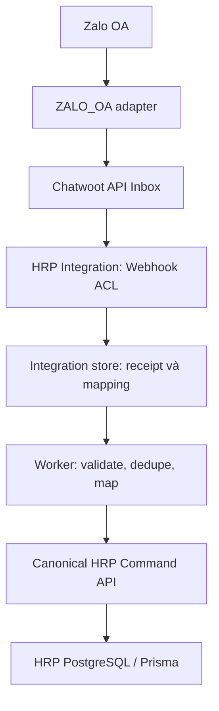
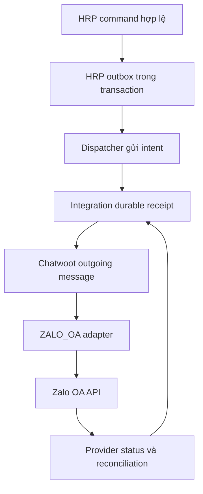

# MASTERPLAN — HRP Omnichannel Engagement

**Phạm vi:** Phân hệ Chatwoot & Zalo OA, HRP V7.9; chuẩn bị nền tảng V7.10.  
**Phiên bản tài liệu:** 2.6 — 12/09/2026.  
**Tên file:** `Master-Plan.V2.6.md` theo yêu cầu Owner.
**Kế thừa:** Toàn bộ V2.5; bổ sung trợ lý AI cá nhân, cấu hình OpenAI-compatible API, KPI chính thức do quản lý giao và báo cáo profile theo sale. Contract tích hợp chi tiết tại hrp-connector.md; các routes/DTO mới trong connector là đề xuất cần HRP-owned PR. Các hướng dẫn cũ yêu cầu chờ API dictionary trước xây UI được thay thế bởi §10.6. Đây là version tài liệu, không đổi version nghiệp vụ HRP V7.9–V7.10.  
**Trạng thái:** Đã cập nhật chỉ thị Canonical Command APIs, chắt lọc Deplao và UI/UX HRP. Owner xác nhận các API này chưa tồn tại; thiết kế và lập trình trong lõi HRP là hạng mục bắt buộc. Chưa triển khai hoặc kiểm thử code production.

## 0. Cách sử dụng và thứ tự ưu tiên

Tài liệu này là đầu vào cho Agent triển khai phân hệ giao tiếp khách hàng của Chợ việc làm thuộc HRP. Các chỉ thị trực tiếp của Owner về HRP V7.9–V7.10 là ràng buộc cao nhất của kế hoạch. Mọi đề xuất trước đó về một CRM độc lập, tự mở case, đồng bộ assignee thành Handling hoặc AI tự quyết định đều bị thay thế nếu trái các ràng buộc dưới đây.

Phân biệt ba loại thông tin:

- **Đã chốt:** bối cảnh, stack và invariants do Owner cung cấp.
- **Đề xuất triển khai:** topology, trường bổ sung, trạng thái kỹ thuật và cách chia package trong tài liệu này; phải review trước khi đóng băng contract.
- **Đã xác nhận còn thiếu:** các Canonical Command APIs liệt kê tại §7.2; phải xây dựng bằng HRP-owned PR.
- **Cần xác minh:** schema/domain services hiện có, quyền, lifecycle, và nội dung `AI_CODING_GUARDRAILS.md` để thiết kế các API còn thiếu. Không coi tên command là bằng chứng đã có implementation.

Các ký hiệu `[span_…]` trong tài liệu Owner chưa có nguồn liên kết truy xuất; không được coi là nguồn đã đọc. Chưa có checkout HRP để đối chiếu ở thời điểm viết kế hoạch. Không tự tạo tên endpoint hoặc migration lõi rồi tuyên bố tương thích HRP.

## 1. Mục tiêu, bối cảnh và phạm vi

### 1.1. Bối cảnh nghiệp vụ

Công ty hoạt động tuyển dụng và cung ứng nhân lực, phục vụ hai phía:

| Đối tượng | Nhu cầu | Nguồn nghiệp vụ chuẩn |
|---|---|---|
| Doanh nghiệp và người liên hệ | Cần tuyển/cung ứng nhân lực | HRP, gồm ClientContact và các model doanh nghiệp/nhu cầu thực tế cần đối chiếu |
| Người lao động | Cần việc, được giới thiệu vào cơ hội phù hợp | HRP LaborProfile, PlacementCase, Application |
| Nhân viên nội bộ | Tư vấn, giao tiếp, kết nối hai phía | Danh tính/quyền hệ thống chính; Chatwoot agent phục vụ thao tác hội thoại |

Mục tiêu ban đầu là khoảng 5–10 nhân viên làm việc trên web. Một Chatwoot account cho công ty là đề xuất triển khai ban đầu; không xây SaaS bán thuê bao cho nhiều doanh nghiệp trong Phase 9. Không đồng nhất Chatwoot account, HRP user, contact và tài khoản Zalo.

### 1.2. Kết quả cần đạt

1. Chatwoot chạy độc lập trên hạ tầng phù hợp và tiếp nhận hội thoại qua các adapter.
2. Zalo OA là kênh production đầu tiên, dùng API chính thức và Chatwoot API Inbox.
3. Nhân viên thấy context HRP được phép xem; hành động nghiệp vụ luôn quay về HRP commands.
4. Dedupe, outbox, retry, DLQ và reconciliation có dữ liệu bền vững, quan sát và replay được.
5. Chatwoot/Zalo lỗi không làm gián đoạn nhập tay hoặc qua điện thoại trong Talent Workbench.
6. Phân hệ có thể phát hành riêng nhưng contract đủ rõ để ghép với HRP; không tạo nguồn sự thật cạnh tranh.

### 1.3. Ngoài phạm vi production đầu tiên

- Quét nhóm Zalo, lấy thành viên ẩn, thu thập khách hàng hàng loạt.
- Facebook cá nhân, Zalo cá nhân, Telegram và Facebook Page production trước Zalo OA.
- Chuyển toàn bộ tính năng desktop Deplao sang web; clone ERP/POS/CRM tuyển dụng mới.
- Tự tạo LaborProfile, PlacementCase, Worker hoặc thay trạng thái nghiệp vụ từ webhook khi chưa có policy/command cho phép.
- Tính phí SaaS, quản lý nhiều tổ chức thương mại, xây lại phân hệ quản trị người dùng.
- AI auto-decision, auto-beneficiary hoặc auto-effective.

## 2. Quyết định kiến trúc nền

### 2.1. Stack đã chốt của HRP

| Hạng mục | Hiện tại | Yêu cầu thiết kế |
|---|---|---|
| Ngôn ngữ | TypeScript 5.7 | Contract integration có version, kiểm tra kiểu và validate runtime |
| Web | React 19, Next.js 15 App Router | Dùng cho UI/context và Route Handlers phù hợp |
| Backend | Next.js Route Handlers | HTTP request ngắn; không giữ worker/cron lâu dài trong request |
| Database/ORM | PostgreSQL, Prisma 5.22 | Migration theo ownership; không cho provider truy cập core DB |
| Production HRP | Vercel + Neon | Giữ HRP hoạt động hiện tại; không buộc chuyển VPS để tích hợp |
| Định hướng | Tự host VPS | Storage/jobs/cron/cache qua abstraction, cấu hình bằng môi trường |

Stack HRP không áp đặt lên upstream Chatwoot: Chatwoot giữ runtime Rails/Sidekiq và các dependency theo release được chọn. Code ACL/adapter/context do dự án sở hữu ưu tiên TypeScript 5.7; không rewrite Chatwoot sang Next.js.

### 2.2. Chọn Chatwoot làm SoE, Deplao là tài liệu tham khảo

Chatwoot phù hợp inbox web nhiều agent và phân công hội thoại. Giữ gần upstream, ưu tiên API/webhook/Dashboard App. Không chạy Deplao song song như một inbox hoặc engine gửi tin chính cho cùng tài khoản.

`zca-bridge` là nguồn tham khảo adapter OA, không phải thành phần được mặc định tin cậy. Pin commit, kiểm tra license, đọc source, sửa OAuth/state/refresh concurrency và kiểm thử trước khi dùng. Không đưa phần Zalo cá nhân vào deployment OA đầu tiên nếu không cần.

Quyết định Community hay gói có custom roles phải qua gate phân quyền. Assignment không đồng nghĩa authorization. Không mặc định bản Community có SSO, Captain AI, SLA hoặc granular roles đầy đủ; kiểm tra theo release/gói được chọn. Không sao chép phần enterprise có giấy phép riêng để vượt điều kiện sử dụng.

## 3. Invariants bắt buộc và semantic firewall

| ID | Ràng buộc | Cơ chế và bằng chứng cần có |
|---|---|---|
| INV-01 | HRP là SoR | Canonical identity, PlacementCase, Worker/Assignment, ReferralAttribution chỉ do HRP quản lý |
| INV-02 | Chatwoot là SoE | Transcript/inbox/chat assignee giữ tại Chatwoot; không diễn giải thành trạng thái HRP |
| INV-03 | Provider không ghi core DB | Không cấp core DB credentials cho Chatwoot/bridge/ACL worker; network và DB grants kiểm chứng |
| INV-04 | Write-through canonical commands | Mutation nghiệp vụ qua command API có auth, policy và idempotency |
| INV-05 | Chat assignee ≠ HandlingAssignment | Event assignee chỉ cập nhật engagement; không tạo/chuyển/gia hạn/expire Handling |
| INV-06 | SLA Handling 7 ngày độc lập | Chat activity, resolve/reopen, reassignment không tự reset đồng hồ Handling |
| INV-07 | Không auto-merge | Identity signal không gộp canonical profiles; conflict vào Unresolved Queue |
| INV-08 | Không auto-open sai quy tắc | Conversation mới không mặc định tạo PlacementCase/Application |
| INV-09 | Core độc lập provider | Provider outage không làm mất Intake/PlacementCase hoặc chặn nhập tay/điện thoại |
| INV-10 | AI suggest-only | Không EFFECTIVE, Beneficiary, Worker tự động; HRP policy quyết định sau review |
| INV-11 | PII tối thiểu | Redact/minimize trước AI, log, payload context; không dump transcript vào HRP |
| INV-12 | Credentials tách quyền quản trị nghiệp vụ | Agent/admin nghiệp vụ không mặc định đọc secret hoặc đổi kết nối |

Các ánh xạ bị cấm: conversation resolved → Placement EFFECTIVE; contact created → LaborProfile mới không qua createOrMatchLaborProfile và policy HRP; chat agent → Beneficiary/Referrer; tin nhắn mới → gia hạn Handling; người trả lời đầu tiên → người sở hữu hoa hồng; Chatwoot label → state nghiệp vụ không qua command.

## 4. Topology và các luồng dữ liệu

### 4.1. Inbound chuẩn

Adapter OA xử lý transport vào Chatwoot; không mở một đường OA → HRP mutation song song. Event transport có thể lưu tại adapter nhưng sự kiện engagement đi vào HRP qua ACL Chatwoot. Không có mũi tên ghi từ provider/bridge tới core DB.

### 4.2. Outbound chuẩn

Đây là đề xuất một đường outbound duy nhất cho mỗi tin. Nhân viên gửi trực tiếp từ Chatwoot đi qua cùng adapter. Không gửi một tin từ cả HRP/Chatwoot/n8n độc lập. Private note, activity event và incoming echo không được gửi tới khách.

### 4.3. Hiện tại: HRP trên Vercel/Neon, engagement trên VPS

- HRP Next.js tiếp tục ở Vercel, core PostgreSQL ở Neon.
- Chatwoot web/worker và OA adapter/ACL workers chạy trên VPS hoặc runtime container có tiến trình dài hạn.
- Integration store dùng PostgreSQL với DB/user riêng; có thể cùng host PostgreSQL nếu grants và backup được phân tách. Không dùng DB user core.
- Webhook receiver ACL ưu tiên ở VPS cùng integration store để receipt nhanh; contract HTTP độc lập vị trí. Nếu đặt Route Handler trên Vercel, chỉ verify + persist + ACK, không thực hiện tác vụ nền sau response.
- Chatwoot Redis phục vụ Chatwoot; không coi cache là nguồn dữ liệu chuẩn. Integration queue ban đầu đề xuất dùng PostgreSQL với lease và locking để giảm thành phần.
- Storage sử dụng interface tương thích object storage/S3; local disk chỉ cho dev hoặc volume tạm có quy trình dọn. Không phụ thuộc filesystem tạm của Vercel.
- HTTPS công khai chỉ cho UI/API/webhook cần thiết. Postgres, Redis, admin vận hành và worker không mở public tùy tiện.

### 4.4. Sau này chuyển HRP về VPS

Giữ nguyên command contract, event envelope, storage keys và idempotency scope. Thay URL và secrets/config, không thay semantics. Next.js chạy container; Prisma migrations được thực thi có kiểm soát. Scheduler dùng cùng SchedulerPort thay vì phụ thuộc cứng Vercel Cron.

Không thiết kế transaction xuyên Neon và integration DB. Atomicity nằm trong từng database; liên lạc liên hệ thống dùng outbox + durable receipt + idempotent consumer.

## 5. Ownership dữ liệu và contract danh tính

| Dữ liệu | Owner | Điều không được làm |
|---|---|---|
| LaborProfile, PlacementCase, Application | HRP | Chatwoot tự cập nhật trạng thái hoặc tạo đối tượng không qua policy |
| Worker/Assignment, HandlingAssignment | HRP | Đồng nhất assignment nội bộ chat với assignment nghiệp vụ |
| ReferralAttribution/Beneficiary | HRP | Suy ra từ agent, inbox hoặc kênh đến |
| Transcript, chat attachment, chat assignment | Chatwoot/SoE | Sao chép toàn bộ sang core như một nguồn chuẩn thứ hai |
| External mapping, event receipts | Integration store | Gắn provider ID vào core tùy tiện hoặc auto-merge |
| Token/session kết nối | Secret store/adapter được cấp quyền | Trả secret về browser hoặc log |
| Danh tính đăng nhập nhân viên | Hệ thống quản trị HRP theo contract cần xác minh | Dùng email trùng làm cơ sở đủ để tự liên kết agent |

Contact doanh nghiệp là người liên hệ, không phải chính doanh nghiệp. Tạo contact Chatwoot để tiếp nhận tin không đồng nghĩa tạo ClientContact/LaborProfile ở HRP.

### 5.1. Quy tắc resolve

1. Kiểm tra scope account/inbox/provider và external identity.
2. Tìm mapping đã được xác nhận, kiểm tra mục tiêu canonical còn hợp lệ.
3. Nếu chưa có và đã xác định là luồng Talent, gửi tín hiệu tối thiểu tới `createOrMatchLaborProfile` qua gateway. Luồng Client dùng contract resolve Client riêng được HRP phê duyệt; thiếu contract thì review, không gọi command Talent để lấp chỗ trống.
4. EXACT_MATCH chỉ theo quy tắc xác minh được HRP chấp nhận hoặc mapping đã review; không chỉ vì giống tên, số điện thoại hoặc provider ID.
5. POSSIBLE_MATCH/UNRESOLVED không thực hiện mutation nhạy cảm; đưa vào review.
6. `NEW_PROFILE` chỉ được trả khi HRP đã tạo profile theo policy được phép. Đây là kết quả command, không thêm vào enum mapping: link tới canonical ID đã xác nhận dùng `EXACT_MATCH`, kèm provenance tạo mới. Thiếu dữ liệu tối thiểu thì trả lỗi validation hoặc chờ review, không bắt buộc tạo hồ sơ.
7. `mergeLaborProfiles` là command đặc quyền, qua review/audit riêng của HRP. Webhook worker không có quyền merge; Integration cập nhật link theo kết quả/sự kiện canonical đã xác minh.

Review lưu người quyết định, thời điểm, lý do, evidence tối thiểu và phiên bản mapping. Cho phép unlink/relink có audit và kiểm tra ảnh hưởng; không replay các mutation cũ tự động khi đổi mapping.

## 6. Schema Integration store — logical proposal

Ba tên bảng bắt buộc theo chỉ thị được giữ nguyên. Các trường sau là đề xuất logic, chưa phải Prisma schema production. Kiểu ID HRP, cardinality và FK phải đối chiếu repo trước migration. Canonical IDs lưu như references; không có cross-database foreign key vào core.

### 6.1. ExternalContactLink

| Nhóm trường | Đề xuất |
|---|---|
| Khóa nội bộ | id, createdAt, updatedAt, version |
| External scope | provider, connectionId, externalAccountId, externalContactId |
| Canonical target | targetType: LABOR_PROFILE hoặc CLIENT_CONTACT; canonicalId nullable |
| Match | EXACT_MATCH / POSSIBLE_MATCH / UNRESOLVED |
| Review | reviewedBy, reviewedAt, reason, evidenceRef |
| Lifecycle | active/superseded/revoked theo contract được review |

Unique external scope phải bao gồm provider + account/connection scope + contact ID; không unique contact ID toàn hệ thống. Một link có tối đa một target chính đang active; cùng contact có nhiều vai trò nghiệp vụ là tình huống review, không chọn tùy tiện. Candidate list tách khỏi confirmed target và hạn chế PII.

### 6.2. ExternalConversationLink

Fields đề xuất: id, connectionId, externalAccountId, externalInboxId, externalConversationId, laborProfileId?, clientContactId?, placementCaseId?, applicationId?, contextVersion, validFrom, validTo?, reviewedBy?, updatedAt.

Một conversation có thể tồn tại qua nhiều đợt tìm việc. Không ghi đè mất lịch sử context. Đề xuất versioned links với chỉ một context hiện hành; ràng buộc active uniqueness và lịch sử được review trước code. Application phải thuộc đúng profile/case theo validation HRP. Conversation với ClientContact không ép có LaborProfile.

### 6.3. ExternalEventReceipt

Fields đề xuất: id, provider, connectionId, accountScope, providerEventId?, dedupeKey, eventType, schemaVersion, occurredAt, receivedAt, payloadHash, payloadRef?, status, attempts, nextAttemptAt, leaseUntil?, leaseOwner?, mappingVersion?, commandIdempotencyKey?, canonicalResultRef?, correlationId, errorCode?, processedAt.

Trạng thái kỹ thuật đề xuất: RECEIVED → PROCESSING → PROCESSED; nhánh NEEDS_REVIEW, RETRY_WAIT, DEAD_LETTER, IGNORED. Dedupe là unique constraint, không chỉ truy vấn trước insert. Worker crash phải có lease expiry để nhận lại. Error lưu mã và nội dung đã redact.

PayloadRef chỉ lưu payload tối thiểu cần replay trong kho hạn chế quyền, mã hóa và có retention; không tạo bản sao transcript vô hạn.

### 6.4. Bảng hỗ trợ đề xuất

- ProviderConnection: mapping provider account/OA/inbox, secret references, capabilities, trạng thái.
- AgentIdentityLink: HRP user ID ↔ Chatwoot agent/account ID; không thay kho danh tính HRP.
- ReviewTask/AuditEntry: candidate review, quyết định và lịch sử thay đổi.
- OutboundIntent/DeliveryAttempt: durable acceptance, từng lần gửi, provider IDs và lỗi.
- ReconciliationCursor: checkpoint theo connection và loại dữ liệu.
- HRP-owned outbox: ở phía HRP, do canonical command ghi cùng transaction khi cần bảo đảm atomicity.

### 6.5. Custom attributes Chatwoot

Giữ đúng `hrp_labor_profile_id`, `hrp_placement_case_id`, `hrp_application_id`. Chốt location contact/conversation theo schema API Chatwoot trong V7.9b; profile context và case/application phải không bị copy nhầm giữa các cuộc chat.

Attributes chỉ là projection để hiển thị, không phải nguồn xác thực. Dù agent sửa được trên UI/API, command vẫn lấy mapping tin cậy từ ACL và kiểm tra quyền HRP. Khi context không còn hợp lệ, clear/update projection có version. Chỉ project sau khi confirmed; unresolved không hiển thị candidate ID như một kết quả đã xác minh.

## 7. Contract và tổ chức code

### 7.1. Provider port

Các interface bắt buộc: verifyWebhook, normalizeInboundEvent, resolveExternalIdentity, mapConversation. Provider adapter xử lý định dạng, chữ ký và external references; canonical identity resolution dùng policy chung/HRP gateway, không nhúng suy đoán nghiệp vụ vào Zalo SDK.

Envelope đề xuất gồm: schemaVersion, provider, connectionId, eventId?, dedupeKey, eventType, occurredAt, receivedAt, externalAccountId, externalInboxId?, externalContactId?, externalConversationId?, externalMessageId?, correlationId, normalizedPayload tối thiểu. Envelope không chứa token/secret. HRP actor không lấy trực tiếp từ field do provider gửi.

Tách cổng:

- CanonicalHrpGateway: read context, resolve signals, execute approved commands.
- IntegrationRepository: receipt, mapping, lease, review, audit.
- QueuePort/SchedulerPort: enqueue, lease, retry, schedule.
- SecretProvider: lấy secret theo connection và capability; không expose value cho UI.
- ObjectStoragePort: private upload/download, retention, signed URL.
- ChatwootGateway và ZaloOaGateway: transport, không giữ policy tuyển dụng.

### 7.2. Canonical HRP Command APIs — bắt buộc xây mới

**Tình trạng do Owner xác nhận:** các API dưới đây chưa tồn tại. Không chỉ tạo client wrapper rồi coi là hoàn tất. Phải bàn giao contract, mock gateway, implementation HRP-owned, migrations cần thiết và bằng chứng kiểm thử. ACL không được import Prisma client lõi hoặc nhận credentials DB lõi.

#### 7.2.1. Danh mục command và semantics

| Command | Contract nghiệp vụ bắt buộc | Quyền và rào cản |
|---|---|---|
| `createOrMatchLaborProfile` | Nhận tín hiệu danh tính tối thiểu, provenance và scope provider/account; trả discriminated union `EXACT_MATCH`, `POSSIBLE_MATCH`, `NEW_PROFILE` | HRP quyết định matching/creation; không auto-merge vì trùng tên, SĐT hoặc ID chat; trường hợp không đủ dữ liệu không bị ép tạo mới |
| `updateLaborProfile` | Bổ sung hồ sơ qua patch whitelist, expectedVersion và mảng `evidenceRef`; chế độ fill-missing cho EXACT_MATCH | HRP kiểm tra quyền, provenance và conflict; không ghi đè dữ liệu đã xác minh hoặc tự merge; xem §10.3 |
| `mergeLaborProfiles` | IDs nguồn/đích, lý do, review reference, expected versions; trả canonical kết quả và thông tin phục vụ cập nhật mapping | Đặc quyền riêng; kiểm tra approval và version tại execution; audit trước/sau; không cấp scope này cho webhook worker |
| `openPlacementCase` | Profile, context nhu cầu tìm việc, policy/approval reference phù hợp | Tối đa một case active/profile, kể cả request đồng thời; chat mới không mặc định mở case |
| `updatePlacementCase` | Case ID, thay đổi được whitelist, expected version | Kiểm tra transition, ownership/context và giới hạn một active case; không nhận arbitrary Prisma update |
| `recordInteraction` | `laborProfileId`, `placementCaseId` (nếu có), `channel`, `direction`, `occurredAt`, `actorUserId`, `outcome`, `summary`, `externalConversationId` | Chỉ summary/reference; case phải thuộc đúng profile; không tự mở case, gia hạn Handling hoặc ghi raw transcript |
| `updateNextAction` | Target context đã xác minh, action ID/create intent theo contract, lịch/hành động và trạng thái `OPEN`, `DONE`, `CANCELLED` | Chốt semantics tạo/cập nhật và transition matrix tại Gate 0; optimistic concurrency; không biến việc đổi lịch thành đổi Handling |
| `recordClientInteraction` | Context `ClientCompany`, `ClientContact`, `SalesOpportunity` theo tính bắt buộc của schema HRP, cùng metadata tương tác tương ứng | Kiểm tra contact/opportunity thuộc đúng công ty; không dùng LaborProfile/PlacementCase thay context doanh nghiệp |
| `transactionalOutboxPublisher` | Ghi notification intent có schema version, destination reference, dedupe key, correlation và payload tối thiểu | Hàm nội bộ HRP nhận transaction context; ghi outbox cùng transaction với mutation lõi; không là HTTP call độc lập sau commit |

Các trường chưa được Owner định nghĩa đầy đủ trong bảng là đề xuất contract, phải đối chiếu schema HRP. Không tự tạo API Client identity hoặc suy diễn quy tắc mở case. Nếu thiếu read/resolve Client contract phục vụ flow, bổ sung HRP-owned PR tương ứng hoặc giữ flow ở Unresolved Queue.

`POSSIBLE_MATCH` không chứa một canonical target được phép ghi tương tác ngay. Candidate IDs/evidence chỉ trả trong phạm vi quyền review. `NEW_PROFILE` không thay enum `ExternalContactLink` ở §6.1. Hai request đồng thời cùng tín hiệu phải được serialize/dedupe phù hợp; khóa kỹ thuật không biến một SĐT dùng chung thành bằng chứng hai người là một.

Merge phải xử lý các liên kết domain theo policy HRP. Nếu hai profile có hai case active hoặc attribution xung đột, chặn/chuyển review tới khi có cách giải quyết được phê duyệt; không tự đóng case hoặc chọn người hưởng hoa hồng. Unlink/relink mapping không tương đương merge profile.

#### 7.2.2. Gate 0: contract trước backend

Định nghĩa trong `packages/contracts` trước khi code backend:

- DTO request/result/error và runtime validation cho từng command; discriminated unions cho matching và enum nghiệp vụ theo schema đã đọc.
- Version contract v1 và quy tắc thay đổi tương thích; version event envelope tách khỏi version API. Endpoint cụ thể là đầu ra Gate 0, chưa giả định đã tồn tại.
- `CanonicalHrpGateway` interface tách Talent, Client, đọc context và command được cấp quyền. Merge dùng capability review riêng, không nằm trong quyền mặc định của adapter inbound.
- Envelope đề xuất: `commandId`, `idempotencyKey`, `schemaVersion`, `correlationId`, source/provider event reference, organization scope và expected version khi cần. Scope/actor do backend xác minh, không tin giá trị body chỉ vì có chữ ký provider.
- Error taxonomy: validation, forbidden, unresolved identity, policy rejection, version conflict, idempotency conflict, retryable dependency error. Chỉ retry lỗi được phân loại tạm thời; lỗi nghiệp vụ đi review hoặc kết thúc có lý do.
- Contract tests và fixtures đã redact dùng chung cho mock gateway và gateway thật; publish/pin package version giữa hai repo, không sao chép DTO rồi để lệch phiên bản.

`actorUserId` của `recordInteraction` phải được định nghĩa rõ cho tin inbound tự động: actor kỹ thuật được HRP cấp phép hay actor nghiệp vụ có chứng thực. Không lấy Chatwoot assignee để giả làm người đã thực hiện tương tác; không tự bỏ trường bắt buộc hoặc gán một sale ngẫu nhiên. Nếu chưa có actor policy, giữ receipt chờ xử lý. Danh tính khách gửi được lưu riêng với executing principal.

#### 7.2.3. HRP implementation và transaction boundary

Dùng TypeScript 5.7, Next.js 15 Route Handlers và Prisma 5.22 trong repo HRP. ACL gọi Route Handlers qua API server-to-server có xác thực; Server Actions nếu dùng cho UI HRP phải gọi cùng domain service, không làm transport RPC phụ thuộc UI cho ACL.

Mỗi command phải:

1. Validate DTO/version, xác thực service và actor/delegation, kiểm tra permission scopes và organization/target authorization. Không mặc định service identity có toàn quyền.
2. Kiểm tra policy/domain invariants, expected version và trạng thái approval hiện hành. Quyền được kiểm tra khi thực thi, không chỉ lúc agent bấm nút.
3. Thực hiện domain mutation, bản ghi idempotency/kết quả, audit thành công và outbox nếu cần trong cùng transaction HRP. Cùng key/cùng payload trả kết quả cũ; cùng key/khác payload trả conflict. Scope key bao gồm organization và command; hash payload không chứa secrets.
4. Audit có `effectiveAt`, `recordedAt`, `actor`, `source`, command/correlation reference. `recordedAt` lấy giờ server; `effectiveAt` theo policy nghiệp vụ. Với interaction, có thể dùng `occurredAt` làm effective time khi hợp lệ; kiểm tra timestamp sai lệch, không để caller giả mạo audit actor.
5. Kiểm soát concurrency ở DB/transaction, không chỉ kiểm tra trước khi insert. Chiến lược unique constraint/locking cho một case active phải dựa trên tập trạng thái active thực tế. Retry transaction có giới hạn và vẫn giữ idempotency key.

Audit các lần bị từ chối theo security audit path, không khiến transaction nghiệp vụ thất bại ghi một log thành công giả. Timeout sau commit được khôi phục bằng cùng idempotency key hoặc API tra kết quả được phê duyệt. Tài liệu hóa retention của dedupe và policy replay quá hạn.

Trước implementation phải đọc bản thật `AI_CODING_GUARDRAILS.md`, AGENTS.md và domain code. Hiện chưa có nội dung guardrails để tuyên bố tuân thủ hoàn toàn; ba yêu cầu tối thiểu đã biết là permission scopes, concurrency/idempotency và audit dual time/actor/source. Nếu thiếu tài liệu, vẫn hoàn thiện contract/mock nhưng chưa đóng gate triển khai lõi.

### 7.3. Repo độc lập — đề xuất

| Vị trí logic | Nội dung |
|---|---|
| apps/integration-api | Webhook/control API; runtime độc lập hoặc Next Route Handlers theo ADR |
| apps/integration-worker | Queue, retry, reconciliation, token refresh |
| apps/context-panel | Next.js 15 / React 19 Dashboard App |
| packages/contracts | Versioned envelopes và schema validation |
| packages/providers/chatwoot | Chatwoot adapter |
| packages/providers/zalo-oa | OA transport và API Inbox bridge |
| packages/hrp-client | Canonical gateway client |
| packages/store | Prisma 5.22 cho Integration store, migrations riêng |
| packages/security | Redaction, secret access, auth verification |
| infra | Docker Compose, config templates, backup/runbook |
| tests | Unit, contract, integration, end-to-end, fault injection |

Đây là sơ đồ thư mục dự kiến, không yêu cầu tạo tất cả app ngay mốc đầu. Pin dependencies và lockfile; runtime Node phải được chọn theo ma trận tương thích thực tế, không tự nâng major stack HRP. Chatwoot upstream dùng image release cố định; custom patches quản lý riêng và tối thiểu.

## 8. Inbound reliability và canonical side effects

Phải resolve danh tính trước khi ghi interaction vào HRP. Điều này không chặn việc lưu durable receipt hoặc tiếp nhận raw chat ở SoE: sự kiện chưa rõ danh tính vẫn được lưu an toàn và ACK theo contract provider, nhưng dừng canonical side effects tại Unresolved Queue. Khi review hoàn tất, replay cùng key và kiểm tra context hiện hành; không tạo interaction trùng.

1. Nhận raw body với size limit và correlation ID.
2. Xác minh nguồn/chữ ký theo provider; validate scope connection và timestamp theo khả năng provider.
3. Chuẩn hóa và insert receipt + công việc trong cùng transaction Integration store.
4. Chỉ ACK thành công sau durable persistence; store lỗi trả trạng thái phù hợp để provider retry.
5. Worker lease receipt; xác định mapping/context đã xác nhận.
6. Event ngoài whitelist chỉ ghi engagement/IGNORED; conflict → NEEDS_REVIEW.
7. Nếu policy cho phép mutation, gọi canonical command với key ổn định.
8. Lưu kết quả. Nếu timeout sau command, dùng cùng key để truy vấn/retry; không tạo key mới.

DedupeKey ưu tiên provider event ID có scope. Nếu không có event ID, thiết kế fingerprint theo event semantics: account + type + message ID + revision/status phù hợp. Không dedupe chỉ dựa vào text/timestamp; hai tin giống nhau có thể là hai event hợp lệ.

Delivery/update events không được nhầm với message-created. Không giả định webhook đến đúng thứ tự; dùng phiên bản hoặc kiểm tra trạng thái hiện hành, không để event cũ ghi đè context mới. Replay qua cùng pipeline, không bỏ qua authorization/mapping review.

## 9. Outbox, retry, DLQ và đối soát

### 9.1. Outbox không chặn transaction HRP

Nếu nghiệp vụ HRP tạo notification intent, canonical transaction gọi `transactionalOutboxPublisher(tx, intent)` để ghi thay đổi nghiệp vụ + outbox row trong core, do HRP sở hữu. Chữ ký này là minh họa transaction boundary, cần đóng băng tại Gate 0. Rollback phải xóa cả mutation lẫn intent; không gọi provider bên trong transaction. Dispatcher chỉ đọc outbox qua cơ chế HRP cấp phép, không cấp core DB credentials cho bridge. Có thể triển khai dispatcher HRP-side hoặc API claim/ack dành riêng; lựa chọn sau khi đọc repo.

Dispatcher gửi intent đến ACL. ACL commit durable receipt trước ACK; HRP có thể retry cùng intent ID. Chỉ đánh dấu outbox dispatched sau acceptance bền vững. Không gọi Zalo/Chatwoot trong transaction nghiệp vụ. Outbound marketing/ad-hoc không tự thay đổi Intake/PlacementCase.

### 9.2. Trạng thái giao tin

Phân biệt INTENT_ACCEPTED, CHATWOOT_CREATED, PROVIDER_ACCEPTED, DELIVERED/READ (nếu provider hỗ trợ), RETRY_WAIT, UNKNOWN, FAILED_FINAL. HTTP 200 từ Chatwoot không đồng nghĩa khách đã nhận.

Provider timeout sau gửi có thể là UNKNOWN. Không cam kết exactly-once delivery khi provider không hỗ trợ. Giữ key ổn định tới các hop; đối soát bằng message mapping/status/history trong phạm vi API cho phép trước khi gửi lại. Không tự retry mù một action có nguy cơ trùng.

### 9.3. Retry và DLQ

- Retry transient timeout/5xx/429 với exponential backoff + jitter và Retry-After nếu có.
- Auth expiry chuyển refresh hoặc yêu cầu cấp quyền lại; policy/business validation không retry vô hạn.
- Lease, max attempts, max age, rate limit và kill switch theo connection.
- DEAD_LETTER lưu intent/event ref, attempts, error code, lastAttemptAt và hướng khắc phục.
- Re-drive có quyền riêng, audit và dùng key cũ; không sửa payload gốc rồi giữ nguyên hash.

### 9.4. Reconciliation

Đối chiếu receipt chưa xong, outbound UNKNOWN, mapping lệch, token lỗi và projection custom attributes. Cursor có overlap window và dedupe; giới hạn tốc độ; không hứa tải đủ lịch sử nếu API không hỗ trợ. Báo sai lệch để review, không tự merge hoặc mở PlacementCase để “sửa” dữ liệu.

## 10. Danh tính nhân viên, quyền và context panel

Tích hợp với phân hệ quản trị HRP qua AgentIdentityLink. Tạm tạo Chatwoot agents cho POC không có nghĩa tạo SoR danh tính mới. Account linking cần quản trị xác nhận hoặc cơ chế xác minh do HRP cung cấp; không chỉ so email.

| Capability | Đối tượng đề xuất |
|---|---|
| Xử lý hội thoại | Agent đã được cấp inbox và quyền cần thiết |
| Review external mapping | Reviewer theo quyền HRP |
| Thực hiện canonical command | Actor được HRP policy chấp thuận |
| Provision/rotate/revoke kết nối | Integration operator riêng |
| Đọc giá trị credentials | Mặc định không có trên UI; chỉ secret runtime cần thiết |
| Replay DLQ / reconciliation repair | Operator/reviewer được cấp riêng, có audit |
| Phê duyệt AI suggestion | Theo loại hành động và policy HRP |

Chatwoot administrator không tự có capability cấu hình secret hoặc sửa mapping canonical. Operator chỉ nhận quyền vận hành cần thiết, không tự có quyền Beneficiary/Placement.

Context panel dùng API đọc HRP có kiểm tra actor/quyền và mapping server-side. postMessage kiểm tra origin/source/schema; ID trong iframe không chứng minh authorization. Không nhúng admin API token vào browser. Thiết kế đăng nhập/SSO cụ thể phải đối chiếu phân hệ quản trị HRP và giấy phép Chatwoot.

Thu hồi HRP user cần thu hồi/quản lý truy cập Chatwoot và context panel theo policy; test API, websocket, tìm kiếm, export, download. Chuyển chat cho người khác không sửa Handling.

### 10.1. UI/UX Context Panel và Unresolved Queue — bắt buộc V7.9a–b

**Nhận diện:** cam là màu chủ đạo theo chỉ thị Owner, đồng bộ hrpartner.vn. Trước chốt UI, thu thập logo, font và design tokens từ nguồn thương hiệu được phê duyệt hoặc giao diện HRP thực tế. Chưa xác minh mã màu/font chính xác; không tự công bố một mã cam là màu thương hiệu chính thức. Tập trung branding ở Context Panel và giao diện tích hợp, kiểm tra khả năng/giấy phép trước khi sửa branding toàn bộ Chatwoot.

React 19/Next.js 15 dùng bộ components chung và tokens cho màu, chữ, spacing, focus, trạng thái. Màu cam cho hành động chính; cảnh báo/lỗi phải có nhãn và biểu tượng, không chỉ phân biệt bằng màu. Bảo đảm đọc được trong panel hẹp, điều hướng bàn phím, focus rõ, nhãn accessible và độ tương phản phù hợp.

| Thành phần | Thông tin/hành động chính | Rào cản |
|---|---|---|
| Context Panel Talent | Tên, liên hệ đã che theo quyền, trạng thái đối chiếu, case hiện hành, application, tương tác gần nhất, hành động tiếp theo | Dữ liệu từ gateway; không tin hrp_* custom attributes để cấp quyền; không tải CCCD/raw transcript mặc định |
| Context Panel Client | Công ty, người liên hệ, cơ hội và tương tác doanh nghiệp | Layout riêng theo context; không ép doanh nghiệp vào Talent |
| Action bar | Mở hồ sơ HRP, ghi tương tác, cập nhật lịch tiếp theo khi được phép | Mutation qua canonical commands; chỉ báo thành công khi có durable result, không dựa vào UI optimistic state |
| Unresolved Queue | Lọc theo nguyên nhân/thời gian, xem evidence tối thiểu, đối chiếu candidates, chọn liên kết hoặc chuyển người có quyền | Không tự chọn candidate đầu tiên; lý do quyết định và mapping version bắt buộc |
| Review detail | So sánh cạnh nhau, xác nhận target/context, ghi lý do, lưu quyết định | Review link khác merge hồ sơ; merge mở workflow đặc quyền riêng của HRP |

Luồng thao tác ưu tiên: mở hội thoại → thấy context trong panel; trường hợp chưa rõ → mở review ngay từ panel → đối chiếu → xác nhận liên kết có lý do → refresh projection sau kết quả backend. Giữ filters/vị trí hàng đợi khi quay lại. Tối giản click bằng context sẵn có và progressive disclosure; không bỏ bước kiểm tra quyền hoặc xác nhận thay đổi danh tính. Khi đã có mapping hợp lệ không bắt nhân viên nhập lại profile ID.

**Trạng thái UI phải có trong mock:** loading, empty, resolved, unresolved, permission denied, HRP offline, timeout chưa rõ kết quả, stale mapping/version conflict, media đang kiểm tra/bị chặn và session hết hạn. Không hiển thị raw error code, stack trace, SQL, JWT hoặc phản hồi provider. Diagnostics có redaction và correlation nằm trong màn hình/log vận hành có quyền riêng.

| Tình huống | Thông báo mẫu cho sale | Hành động |
|---|---|---|
| HRP chưa phản hồi | “Chưa tải được hồ sơ. Bạn có thể tiếp tục chat và thử tải lại.” | Tải lại context; không tự tạo hồ sơ thay thế |
| Ghi interaction bị timeout | “Chưa xác nhận được thao tác đã lưu. Hệ thống đang kiểm tra kết quả.” | Tra kết quả hoặc retry cùng key; không cho double-submit tạo lệnh mới |
| Mapping đã thay đổi | “Liên kết hồ sơ đã được cập nhật. Hãy tải lại trước khi xác nhận.” | Refresh/review; không ghi đè quyết định mới |
| Không đủ quyền | “Bạn chưa có quyền xử lý mục này. Hãy chuyển cho người phụ trách.” | Chuyển review theo quyền, không tiết lộ candidate bị hạn chế |
| Media đang quét/bị chặn | “Tệp đang được kiểm tra an toàn.” / “Tệp này không thể mở vì không đạt kiểm tra an toàn.” | Không có link tải bypass; chuyển xử lý theo policy |

**Backlog UI:** UX-01 tokens/components và layout Talent/Client; UX-02 Context Panel với mock gateway; UX-03 Unresolved Queue và review permissions; UX-04 error/timeout/stale-state UX; UX-05 nhúng Chatwoot POC và auth thực; UX-06 pilot 5–10 sale. UX-01–04 ở V7.9a; UX-05–06 ở V7.9b. Không sửa Prisma core để làm demo; mock data là dữ liệu giả, không PII thật. Mock phải mô phỏng cả từ chối quyền, không chỉ happy path.

**Nghiệm thu:** người dùng hoàn thành xem hồ sơ/ghi tương tác/đối chiếu mapping mà không rời chat trừ khi nghiệp vụ cần HRP; đo số click, thời gian và lỗi với cùng kịch bản trước/sau để chốt baseline. Không đặt mục tiêu ít click hơn bằng cách bỏ review. Backend phải chặn request trái quyền ngay cả khi gọi REST thủ công hoặc sửa UI.

### 10.2. Phân chia khách và công việc theo trọng số — V2.1

**Quyết định:** hỗ trợ trọng số nhận khách `1x`, `2x`, `3x`… Một nhân viên 3x được phân lượng khách mới mục tiêu gấp ba nhân viên 1x trong cùng nhóm phân phối và cùng điều kiện đủ nhận. Trọng số là tỷ lệ tương đối, không phải số lượng cố định hoặc mức đánh giá chất lượng nhân viên.

Phân biệt hai nhu cầu để tránh nhầm “nguồn” và “khách”:

- **Quy hoạch nguồn inbox:** nếu có 10 nguồn độc lập (OA/Page/inbox), quản lý có thể gán A phụ trách 3 nguồn, B 2, C 1, D 4. Đây là ma trận nguồn → nhóm/nhân viên được phép nhận. Số nguồn không phản ánh lượng khách vì mỗi nguồn có lưu lượng khác nhau.
- **Phân phối khách từ các nguồn:** gom các nguồn được chọn vào routing pool; áp dụng trọng số cho khách mới đủ điều kiện. A=3x, B=2x, C=1x, D=4x tương ứng mục tiêu 30%, 20%, 10%, 40% trong pool.

| Nhân viên | Trọng số | Tỷ lệ mục tiêu | Batch 10 khách đủ điều kiện | Batch 100 khách đủ điều kiện |
|---|---|---|---|---|
| A | 3x | 30% | 3 | 30 |
| B | 2x | 20% | 2 | 20 |
| C | 1x | 10% | 1 | 10 |
| D | 4x | 40% | 4 | 40 |

Ví dụ trên giả định cùng pool, cả bốn người đều đủ quyền, trong ca, chưa đầy tải và không có khách cần giữ người phụ trách. Khi chia từng khách realtime, tỷ lệ được cân bằng dần; không cam kết mọi cửa sổ 10 khách đều đúng 3/2/1/4 nếu điều kiện thay đổi. Quota cứng và trọng số là hai cấu hình khác nhau.

#### 10.2.1. Đơn vị phân việc và giới hạn ownership

MVP phân **cơ hội tiếp nhận hội thoại mới**, không phân lại mỗi tin nhắn. Một conversation có routing decision duy nhất cho lần tiếp nhận; tin tiếp theo đi theo người đang chăm sóc. Khách quay lại/reopen ưu tiên người đang phụ trách chat nếu còn đủ điều kiện, với timeout/fallback được cấu hình. Không nhân quota do provider retry, private note hoặc echo.

Nếu cần phân một NLD duy nhất trên nhiều OA/kênh, chỉ dùng canonical link đã xác nhận qua HRP để nhận biết cùng người. Identity chưa resolve vẫn có thể phân chat để phục vụ, nhưng chưa được coi là khách canonical duy nhất trong KPI; không tự merge bằng SĐT. Gate contract phải chốt routing unit, sticky window và điều kiện kết thúc một lần tiếp nhận.

Router chỉ điều phối assignment trong Chatwoot/SoE. Không tạo hoặc gia hạn HRP HandlingAssignment, không đặt lại SLA 7 ngày, không đổi PlacementCase/Worker/ReferralAttribution/Beneficiary. NextAction HRP vẫn đi qua canonical commands; UI phải phân biệt “người nhận chat” và “người phụ trách nghiệp vụ HRP”.

#### 10.2.2. Cấu hình dành cho quản lý

Màn hình “Phân bổ khách” theo organization/pool gồm:

1. Chọn nguồn inbox và loại luồng Talent/Client; kỹ năng/địa bàn nếu có dữ liệu tin cậy. Không để các rule chồng lấn tạo hai pool cùng xử lý một hội thoại: có priority và một pool thắng duy nhất.
2. Chọn nhân viên được cấp quyền inbox; nhập trọng số nguyên dương qua chips 1x/2x/3x/4x hoặc giá trị hợp lệ. Tạm dừng là trạng thái riêng, không lẫn với 0x gây mẫu số 0.
3. Thiết lập ca/availability, số hội thoại active tối đa, quota khách mới theo ca/ngày nếu cần, người/queue dự phòng. Không suy ra online từ tab đang mở; availability dùng nguồn được phê duyệt và có thời điểm hết hạn.
4. Xem preview tỷ lệ và mô phỏng 10/100 khách; nêu rõ ai bị loại vì offline/hết quota/thiếu quyền và tỷ lệ sau khi chuẩn hóa lại.
5. Lưu cấu hình có version/audit và thời điểm hiệu lực. Thay đổi mặc định chỉ áp dụng khách mới; chuyển hàng loạt khách đang chăm sóc là thao tác riêng có preview, lý do và quyền.

Ví dụ A=3x nhưng đã đầy tải: loại A khỏi tập đủ nhận, B/C/D tạm nhận theo 2:1:4. Khi A quay lại không bù dồn mọi khách đã bỏ lỡ; reset/giới hạn accumulated credit theo policy đã chốt để tránh một đợt tải đột ngột. Không có ai đủ điều kiện thì giữ ở unassigned queue bền và cảnh báo người trực, không nới quyền hoặc bỏ khách.

#### 10.2.3. Thuật toán và reliability

Đề xuất realtime **smooth weighted round-robin** trên tập nhân viên đủ điều kiện: cộng weight vào currentWeight, chọn người có currentWeight lớn nhất bằng tie-break ổn định, trừ tổng weight của tập đủ điều kiện ở người được chọn. State theo pool/config version; cập nhật eligibility phải quản lý credit như trên. Đây là đề xuất thuật toán cần benchmark/simulation, không nhận định Chatwoot có sẵn đầy đủ capability này.

Batch chủ động có thể dùng largest remainder: quota thực = N × weight/tổng weight; lấy phần nguyên rồi phân phần dư theo thứ tự phần lẻ, tie-break công bằng qua các batch. Khi có capacity/quota phải phân lại phần còn dư trên người còn khả năng nhận; không đủ sức chứa thì phần thừa chờ queue. Không trộn batch engine và realtime engine trên cùng tập khách mà thiếu coordination.

Luồng bền: durable receipt → chọn pool/eligible set → transaction Integration store ghi decision + reservation/counter + dispatch job → gọi API assignment Chatwoot → reconcile kết quả. Không có transaction phân tán với Chatwoot; timeout ở API không được lập decision mới cho nhân viên khác ngay. Retry cùng decision, đọc lại assignee trước retry và giữ `PENDING_APPLY/UNKNOWN` tới khi đối soát. Các trạng thái là đề xuất integration, không phải trạng thái HRP.

Unique key theo organization, conversation và intake generation; khóa/transaction pool hoặc cơ chế serialization tương đương để hai worker không cùng chọn vượt capacity. Reservation phải tính vào tải; expiry không tự giải phóng khi assignment còn UNKNOWN. Ghi routing reason, config version, eligible-set snapshot tối thiểu, chosen agent, weight, attempt, actor và timestamps; không log dữ liệu nhạy cảm không cần thiết.

Chọn một authority cho mỗi pool: nếu custom router điều khiển, tắt/cấu hình native auto-assignment để không tranh nhau. Native assignment/manual override được phát hiện và có policy ưu tiên; không âm thầm ghi đè quyết định của quản lý. Vì API có thể không hỗ trợ compare-and-set, cần POC chứng minh giới hạn race, dùng assignment event/reconciliation và báo conflict khi không bảo đảm; không tuyên bố exactly-once external assignment.

Quyền đề xuất: `routing.config.manage`, `routing.override`, `routing.metrics.read`. Kiểm tra server-side organization/inbox/user membership và version. Business admin không được cấp credential provider chỉ để cấu hình tỷ lệ. AI không tự sửa trọng số dựa trên điểm chất lượng; có thể gợi ý cho quản lý xem và duyệt.

#### 10.2.4. Backlog và nghiệm thu routing

| ID | Phase | Đầu ra |
|---|---|---|
| ROUTE-01 | V7.9a | Contracts routing unit/pool/weights/caps/sticky, mock và simulator; không sửa Prisma core |
| ROUTE-02 | V7.9a | UI cấu hình nguồn và trọng số, preview 10/100 khách, audit/version |
| ROUTE-03 | V7.9b | Chatwoot POC assignment API/permissions, single authority, manual override/reopen |
| ROUTE-04 | V7.9c | Zalo OA production routing, durable decisions/reservations, retry/reconcile, unassigned queue |
| ROUTE-05 | V7.10a/d | Biểu đồ tỷ lệ mục tiêu/thực nhận, capacity và lý do lệch; drill-down decisions |

Nghiệm thu gồm công bằng trọng số khi eligibility ổn định, không vượt capacity do request đồng thời, không phân lại vì duplicate, và xử lý đúng unavailable/UNKNOWN/manual override. Đo chênh lệch thực nhận với mục tiêu theo từng tập eligible và cửa sổ, không kết luận router lỗi chỉ vì tỷ lệ thô lệch 30/20/10/40 khi nhân viên nghỉ ca. Phân bổ công bằng số lượng không đồng nghĩa công bằng độ khó/giá trị lead; báo cáo breakdown nguồn để quản lý điều chỉnh có căn cứ.

### 10.3. Staff-assisted Intake & Profile Completion — V2.2

**Mục tiêu:** nhân viên đang chat mở Intake Form ngay trong Context Panel, nhập thông tin, mở “Xem lại hồ sơ” và sau đó bấm “Xác nhận gửi hồ sơ sang HRP” theo §10.7. Custom Action/Macro nếu Chatwoot edition hỗ trợ chỉ là điểm mở form; không nhúng token, CCCD hoặc lệnh chuyển nghiệp vụ trực tiếp vào macro. Form React/Next.js dùng mock ở V7.9a, tích hợp thật theo HRP-owned contracts; không dùng Prisma core từ UI/ACL.

#### 10.3.1. Payload và trạng thái form

Payload convert hoàn chỉnh tối thiểu theo Owner gồm họ tên, SĐT, số CCCD, địa chỉ trên CCCD, ảnh mặt trước/mặt sau dưới dạng evidenceRef, và Business Intent. Các trường số/địa chỉ là dữ liệu HRP bảo vệ, không đẩy vào Chatwoot custom attributes. Contract phải phân biệt địa chỉ trên giấy tờ với địa chỉ liên hệ, không ghi đè lẫn nhau.

| Nhóm DTO đề xuất | Trường/semantics |
|---|---|
| Dữ liệu hồ sơ | fullName, phone, citizenIdentity.number, citizenIdentity.address; tên trường thật chốt với backend HRP |
| Evidence | `evidenceRef[]`, mỗi phần tử gồm opaque evidenceId, loại CCCD_FRONT/CCCD_BACK; metadata scan/provenance do server xác minh, không tin client khai “đã quét” |
| Business intent | Business Intent cùng placementCaseStage và availability theo constants §10.6; availableFromDate khi cần; contract version chung, không arbitrary status |
| Context | Conversation/connection reference, canonical target/version nếu đã resolve; organization và actor xác thực ở server |
| Reliability | intakeRequestId, idempotencyKey, expectedVersion, correlationId, source và thời gian thu thập theo contract |

SĐT normalize dùng để tìm trùng cơ bản; **không dùng SĐT làm idempotency key duy nhất hoặc bằng chứng auto-merge**. SĐT có thể dùng chung/đổi chủ; CCCD được kiểm tra định dạng và xung đột theo HRP policy, không coi ảnh hoặc OCR chưa xác minh là bằng chứng đúng danh tính. Search/index nhạy cảm chỉ do HRP quản lý; nếu cần blind index thì dùng keyed HMAC với secret được bảo vệ, không hash SĐT thuần dễ dò.

Form hiển thị nhóm thông tin, trạng thái tệp và preview phần sẽ bổ sung; không prefill dữ liệu mơ hồ như dữ kiện đã xác nhận. Với convert hoàn chỉnh, thiếu trường bắt buộc hoặc mặt CCCD chưa sạch thì giữ “Chưa đủ thông tin”, không submit giả. Cho phép tiếp tục chat và lưu nháp theo quyền/TTL ở dịch vụ nội địa, không coi draft là canonical profile/case. Không giữ CCCD trong localStorage, URL/query string, analytics hoặc session replay. Luồng intake khác ít dữ liệu hơn chỉ được hỗ trợ nếu HRP có contract/policy riêng; yêu cầu này không làm việc nhập tay/điện thoại hiện có ngừng hoạt động.

#### 10.3.2. Identity resolution và cập nhật hồ sơ an toàn

Luồng: form đã validate → evidence sạch được xác nhận → nhân viên review và xác nhận revision theo §10.7 → ACL gọi `createOrMatchLaborProfile` → xử lý outcome → hoàn thiện canonical profile → xử lý business intent được HRP cho phép.

| Kết quả | Xử lý bắt buộc | Điều kiện đi tiếp |
|---|---|---|
| EXACT_MATCH | Tự động gọi `updateLaborProfile` ở chế độ fill-missing cho canonical ID HRP trả về; đính evidence hợp lệ theo policy | Command cập nhật thành công hoặc no-op hợp lệ; nếu dữ liệu xung đột chuyển review |
| POSSIBLE_MATCH | Đưa vào Unresolved Queue với evidence tối thiểu và quyền riêng; không cập nhật candidate hoặc auto-merge | Reviewer xác nhận target hoặc cho phép tạo mới qua HRP; resolve lại và hoàn tất command hồ sơ |
| NEW_PROFILE | HRP đã tạo profile và nhận evidenceRef hợp lệ theo creation policy | Có canonical ID/kết quả bền; intent vẫn phải được kiểm tra riêng |

Giải thích điều kiện “chỉ NEW_PROFILE hoặc review xong mới đi tiếp”: hồ sơ mới hoặc trường hợp mơ hồ phải đi đúng hai nhánh đó; **EXACT_MATCH cũng được đi tiếp sau khi fill-missing hoàn tất**, vì danh tính đã được HRP xác nhận. Nếu Owner muốn mọi EXACT_MATCH đều review thủ công thì đó là policy bổ sung, không phải mặc định suy diễn từ matching enum.

“Cập nhật thông tin còn thiếu” nghĩa là chỉ điền trường rỗng hợp lệ trong whitelist, không thay giá trị đã có bằng dữ liệu chat mới. Số CCCD/địa chỉ/SĐT mâu thuẫn phải có correction workflow được HRP duyệt; ACL không được chọn nguồn thắng. Update dùng expectedVersion, kiểm tra lại từng trường trong transaction; nếu người khác vừa điền thì re-read/review, không ghi đè. Evidence thêm vào là supporting evidence, không tự đổi trạng thái xác minh CCCD.

Review link một contact với hồ sơ không đồng nghĩa `mergeLaborProfiles`. Nếu thực sự cần merge hai profile, mở workflow merge đặc quyền của HRP với approval/audit, bảo toàn invariant active-case/attribution. Sau review không replay mù bằng payload/version cũ; revalidate scope, evidence, profile version và business intent.

#### 10.3.3. State mapping và business intent

Các enum chính thức ở §10.6 được khai báo cố định trong packages/contracts và dùng ngay cho UI/mock, không chờ API dictionary. Backend vẫn phải validate enum, permissions, required evidence, transitions và managed mode ở execution. Capability API cho allowed actions/context là hạng mục HRP-owned nếu cần, không phải dependency để hiển thị từ điển. Giá trị enum hợp lệ không đồng nghĩa được phép chuyển tới stage đó từ mọi trạng thái.

| Chọn trên form | Mapping dự kiến | Gate nghiệp vụ |
|---|---|---|
| Khởi tạo hồ sơ / Đang tư vấn | Sau identity completion, gọi `openPlacementCase` với stage HRP cho phép, NEW/CONTACTING/QUALIFYING theo lựa chọn hợp lệ và policy transition | Đây là yêu cầu chủ động của nhân viên, vẫn cần policy cho mở case; có case active thì reuse/cập nhật bằng command phù hợp, không mở case thứ hai |
| Đã chốt hợp đồng / Nhận việc | Tạo yêu cầu thực hiện workflow Placement tương ứng; HRP quyết định có đủ điều kiện đạt EFFECTIVE | Phải xác minh HRP_MANAGED/CLIENT_MANAGED, contract/assignment và chứng cứ, permissions/approval; không map một dropdown thành ghi thẳng EFFECTIVE |

Các command tạo/hoàn tất Placement chưa được cung cấp tên/chữ ký: tạo HRP-owned PR sau đọc domain và guardrails; không tự đặt endpoint rồi coi đã tồn tại. Khi đủ policy và approval, canonical workflow mới tạo/chuyển Placement tới EFFECTIVE. Thiếu điều kiện thì UI hiển thị “Hồ sơ đã lưu; yêu cầu nhận việc đang chờ xác nhận”, không báo chốt thành công. Không tạo Worker hoặc chọn Beneficiary ngoài quy trình HRP đã cho phép. BoD chỉ đếm kết quả từ HRP event xác nhận, không đếm nhấn Convert hoặc chọn “Nhận việc”.

#### 10.3.4. Partial success, retry và audit

Một intake có operation record/checkpoint bền trong Integration store: evidence ready → identity resolved → profile completed → business intent pending/completed. Không có distributed transaction giữa storage, ACL và HRP. Mỗi command dùng key ổn định riêng gắn intakeRequestId + step; retry sau timeout tra kết quả cũ. Profile đã tạo nhưng mở case thất bại thì giữ hồ sơ và retry đúng bước, không xóa hồ sơ hoặc tạo lại. Claim evidence idempotent theo request/profile; tệp chưa claim hết TTL chỉ dọn sau đối soát, không xóa ảnh đang được command UNKNOWN sử dụng.

HRP audit command có effectiveAt, recordedAt, actor, source và changed-field metadata; audit nhạy cảm cần mã hóa/giới hạn quyền, không rải bản sao số CCCD vào log thường. Luồng browser có CSRF/session/delegation protection phù hợp; postMessage kiểm tra origin/source; service không giả làm sale bằng actorUserId từ body. Mọi scope/object/evidence ownership được kiểm tra server-side.

### 10.4. ADR-MEDIA-01-VN — Evidence CCCD nội địa

Đây là phần bổ sung bắt buộc cho ADR-MEDIA-01, ưu tiên hơn đề xuất S3 chung đối với CCCD. Storage tương thích S3 được self-host trên VPS vật lý tại Việt Nam; chọn sản phẩm sau review vận hành/license. Bucket quarantine và clean private riêng, scan worker nội địa, encrypted volumes/object encryption và khóa truy cập được quản lý riêng. Không bật public ACL/CDN ngoài phạm vi cho phép.

**Luồng nhận:** Zalo/Webchat → receiver nội địa → quarantine có TTL → chống SSRF/MIME spoof/giới hạn dung lượng → malware scan fail-closed → clean encrypted storage → opaque evidence reference → command HRP. Preview/thumbnail cũng là dữ liệu nhạy cảm, chỉ tạo sau scan và lưu cùng ranh giới nội địa. Không gửi CCCD/ảnh vào AI/OCR cloud hoặc telemetry ngoài phạm vi; OCR nếu cần là task riêng nội địa, kết quả vẫn cần xác nhận.

**Ranh giới Vercel/Neon hiện tại:** không đưa ảnh CCCD qua Vercel Route Handler, Neon bytea, remote scanner, debug proxy hoặc upload path ngoài Việt Nam. Browser upload tới endpoint nội địa có xác thực; receiver/worker và staging cũng nội địa. Số CCCD, địa chỉ, request buffers, logs, backups/replicas và disaster recovery là dữ liệu cá nhân cần đưa vào sơ đồ residency, không chỉ ảnh. Trước production phải xác minh region thực tế và phạm vi lưu trú được yêu cầu; nếu HRP core hiện tại không đáp ứng, di chuyển phần xử lý/lưu trữ cần thiết sang hạ tầng Việt Nam hoặc dùng HRP-owned PII service nội địa với core giữ references. Việc tách service cần ADR/HRP-owned PR, không tự xây kho danh tính canonical song song trong ACL.

**Reference-only:** `evidenceRef` là định danh tham chiếu tới object đã mã hóa và được bảo vệ, không phải một URL được “mã hóa” là đủ an toàn. Core lưu opaque reference ổn định; signed URL TTL chỉ phát theo yêu cầu đọc có quyền và không dùng làm khóa lưu dài hạn. Chatwoot attributes chỉ có opaque reference nếu cần; ưu tiên panel truy evidence gateway. Không lưu số CCCD, địa chỉ, raw Zalo URL, storage credentials hoặc signed URL trong labels, macros, notes hay custom attributes dùng chung. TTL đề xuất 60–300 giây, chốt theo policy; authenticated proxy nếu cần thu hồi tức thời.

**Không lưu vĩnh viễn trên Chatwoot/Zalo:** bridge không upload lại ảnh CCCD vào Chatwoot attachments; nội dung thay bằng reference được bảo vệ. Với Webchat do mình kiểm soát, dùng secure upload riêng để tránh lưu bản sao mặc định ở Chatwoot. Với Zalo, khách đã gửi ảnh thì provider có thể đã giữ bản sao: hệ thống không thể bảo đảm xóa phía Zalo khi API/quyền không hỗ trợ. Cần xác minh retention/delete capability và ghi giới hạn này; nếu yêu cầu là ảnh không được nằm ở provider, cho khách dùng secure upload nội địa thay vì gửi CCCD qua chat.

Đối với bản sao Chatwoot đã có trước khi nhận diện CCCD, task migration/cleanup phải inventory attachment, thumbnail/cache và backups, xác minh bản nội địa sạch/khả dụng rồi xử lý bản dư theo retention/khả năng API, có audit. Không hứa xóa tức thời backups hoặc dữ liệu provider nằm ngoài quyền kiểm soát. Form chủ động thu CCCD qua đường secure upload là mặc định cho dữ liệu mới; media tự phát cần kiểm tra/classification nội địa và giữ quarantine khi chưa rõ.

Data localization ở đây là yêu cầu kiến trúc của Owner. Đáp ứng vị trí VPS không tự chứng minh tuân thủ đầy đủ pháp luật: trước production cần người phụ trách dữ liệu xác nhận mục đích/căn cứ xử lý, thông báo cần thiết, retention/xóa, quyền truy cập, phạm vi chuyển dữ liệu và vị trí backup theo quy định áp dụng. Ghi quyết định vào ADR, không tuyên bố đã được kiểm định pháp lý trong kế hoạch này.

### 10.5. Backlog Intake V2.2 và gate triển khai

| ID / Label | Phase/Owner | Task và đầu ra |
|---|---|---|
| INTAKE-01 UI/UX | V7.9a | Intake Form mock: dữ liệu, 2 mặt CCCD, Business Intent, field validation, quyền, missing/conflict/partial success states; không PII thật |
| INTAKE-02 CONTRACT | Gate 0 + HRP-owned | DTO createOrMatchLaborProfile/updateLaborProfile hỗ trợ evidenceRef[], fill-missing/version/audit; constants ba trục chính thức/stage transition/managed-mode contracts |
| INTAKE-03 HRP-OWNED | HRP PR sau mock | Implement updateLaborProfile, mở rộng createOrMatchLaborProfile, evidence authorization/claim; shared contract tests thật |
| INTAKE-04 UI/UX | V7.9b | Nhúng Chatwoot POC; action/macro chỉ mở form; EXACT/POSSIBLE/NEW và Unresolved review đúng quyền |
| INTAKE-05 DEPLAO_FEATURE / MEDIA | V7.9c | Zalo/Webchat → quarantine → scan → VPS S3 nội địa; evidence gateway, signed URL/TTL, SSRF/IDOR protection |
| INTAKE-06 HRP-OWNED | Trước bật state mapping thật | Constants §10.6, capability/transition validation và policy open/reuse case và workflow Placement EFFECTIVE theo managed mode; command còn thiếu phải có PR |
| INTAKE-07 SECURITY / RESIDENCY | Trước nhận CCCD production | Data-flow/region inventory cả Vercel/Neon, logs/backups; secure upload, retention/cleanup và giới hạn Zalo được ghi nhận |
| INTAKE-08 RELIABILITY | V7.9c–e | Checkpoints/retry/idempotency, evidence orphan reconciliation và audit; không mất profile khi bước sau lỗi |

Phụ thuộc: INTAKE-01 mock có thể làm ngay; tích hợp canonical thật chỉ sau INTAKE-02–03. INTAKE-05/07 phải đạt trước nhận CCCD thật. Chỉ bật intent EFFECTIVE sau INTAKE-06 được HRP nghiệm thu; phần chưa có policy hiển thị chưa khả dụng/chờ xác nhận, không bypass DB. Production OA thường không bị coi là đã có intake CCCD chỉ vì gửi/nhận text hoạt động.

### 10.6. Từ điển ba trục HRP chính thức — V2.3

Nguồn có thẩm quyền là chỉ thị Owner trong cuộc trao đổi này. Được phép khai báo cố định các constants sau trong `packages/contracts` và import vào UI/ACL/mock ngay; không chờ backend dictionary API và không sao chép nhiều enum khác nhau giữa các repo. Nhãn tiếng Việt tách khỏi enum wire value; version package và compatibility tests dùng chung với HRP. Đây là cập nhật kế hoạch, chưa phải đã triển khai constants vào repo.

#### 10.6.1. PlacementCase — tiến độ đợt tìm việc

| Enum đã chốt | Nhãn UI | Điều kiện/ý nghĩa |
|---|---|---|
| NEW | Nhu cầu mới | Chưa cần Application cụ thể |
| CONTACTING | Đang liên hệ | Không nghe máy vẫn ở CONTACTING; kết quả cuộc gọi ghi vào interaction outcome, không thêm stage mới |
| QUALIFYING | Đang xác định nhu cầu | Chưa nhất thiết có Job |
| MATCHING | Đang tìm việc phù hợp | Đã đủ thông tin để tìm Job |
| PROPOSED | Đã đề xuất việc | Thuộc nhóm sau ghép Job; HRP kiểm tra context Job/Application cần thiết |
| INTERESTED | Quan tâm việc đã đề xuất | Thuộc nhóm sau ghép Job, không đồng nghĩa nhận việc |
| CLIENT_PROCESS | Đang trong quy trình khách hàng | HRP kiểm tra workflow/context tương ứng |
| READY_TO_START | Sẵn sàng bắt đầu | Không đồng nghĩa EFFECTIVE hoặc đã đi làm |

**Quy tắc đóng chính thức được Owner cập nhật:** mọi lần đóng PlacementCase dùng `status = CLOSED`; lý do nằm ở `closeReason`. Các stage tiến độ NEW đến READY_TO_START ở bảng trên không phải status đóng. Không thêm stage đóng thành công/thất bại, không gửi lại các giá trị đóng cũ từ kế hoạch trước. Cách giữ stage cuối cùng khi đóng và status khi reopen do HRP policy quyết định, không tự phát minh enum còn thiếu.

| closeReason chính thức | Nhãn UI |
|---|---|
| SUCCESS | Đã ghép việc thành công |
| NO_LONGER_LOOKING | Không còn nhu cầu tìm việc |
| UNREACHABLE | Không thể liên lạc được |
| NO_SUITABLE_JOB | Không có công việc phù hợp |
| CANDIDATE_WITHDREW | Người lao động rút lui/từ chối |
| CLIENT_REJECTED | Doanh nghiệp từ chối |
| DUPLICATE_CASE | Trùng lặp đợt tìm việc |
| INVALID | Hồ sơ không hợp lệ |
| OTHER | Lý do khác |

UI dùng action riêng “Đóng đợt tìm việc”, dropdown lý do bắt buộc, preview tác động và bước review/xác nhận theo §10.7. Đề xuất yêu cầu giải thích khi OTHER; comment/evidence requirements của từng reason phải chốt HRP policy. Nhãn “Đóng hồ sơ” nếu có phải giải thích chỉ đóng case, không xóa LaborProfile hoặc làm mất lịch sử.

Command đóng phải cập nhật status/closeReason cùng transaction, kiểm tra actor/scope, expectedVersion, policy, audit và idempotency. Đề xuất `closePlacementCase` trong HRP-owned PR; nếu HRP dùng updatePlacementCase thì cùng domain service phải bảo đảm các invariant tương đương. Không cần chờ API dictionary để tạo dropdown với enum đã chốt.

SUCCESS chỉ được chấp nhận khi HRP xác minh điều kiện thành công; không tự tạo Placement EFFECTIVE/Worker/Beneficiary. Không nghe máy một lần vẫn CONTACTING + interaction outcome; UNREACHABLE là quyết định đóng có policy và review. DUPLICATE_CASE không merge hồ sơ; INVALID không xóa hồ sơ; CLIENT_REJECTED phải kiểm tra phạm vi case so với một Application bị từ chối, không tự đóng toàn case từ sự kiện một job.

Đóng case không tự đổi Availability/CurrentRelationship, không gỡ DO_NOT_CONTACT hoặc reset Handling; mọi tác động liên quan nếu cần phải do HRP policy/commands sở hữu. Reopen cần command/transition hợp lệ và kiểm tra tối đa một case active; không xóa dấu vết closeReason trước đó khỏi audit. Dashboard phân nhóm đóng theo closeReason; số case đóng SUCCESS khác NLD duy nhất nhận việc hoặc Placement EFFECTIVE.

#### 10.6.2. Availability — mức sẵn sàng nhận việc

| Enum đã chốt | Nhãn UI | Validation và hành vi |
|---|---|---|
| AVAILABLE_NOW | Có thể đi làm ngay | Không tự mở case hoặc đổi quan hệ việc làm |
| AVAILABLE_FROM_DATE | Sẵn sàng từ ngày | Bắt buộc availableFromDate hợp lệ trong tương lai theo lịch nghiệp vụ Asia/Ho_Chi_Minh |
| NOT_AVAILABLE | Chưa cần việc lúc này | Không mặc định đóng case hoặc ghi nghỉ việc |
| DO_NOT_CONTACT | Không muốn HRP liên hệ | Bắt buộc block mọi luồng gửi tự động theo §10.6.5 |
| UNKNOWN | Chưa rõ | Không suy ra AVAILABLE_NOW khi dữ liệu thiếu |

Chốt DTO availableFromDate là ngày lịch YYYY-MM-DD để tránh lệch múi giờ; giờ bắt đầu nếu nghiệp vụ cần phải có contract riêng. Khi đổi khỏi AVAILABLE_FROM_DATE, command phải xử lý ngày cũ rõ ràng (clear khỏi projection hiện hành, giữ audit), không để dữ liệu mâu thuẫn. Đến ngày hẹn không tự chuyển sang AVAILABLE_NOW nếu chưa có HRP policy cho phép.

#### 10.6.3. CurrentRelationship — projection chỉ đọc

| Enum đã chốt | Badge hiển thị |
|---|---|
| NEVER_WORKED | Chưa từng làm qua HRP |
| WORKING_VIA_HRP | Đang làm qua HRP |
| FORMER_HRP_WORKER | Đã từng làm qua HRP |
| WORKING_EXTERNAL | Đang làm ngoài HRP |
| UNKNOWN | Chưa đủ dữ liệu |

Backend HRP tính projection từ lịch sử Assignment/Episode/quan hệ việc làm. UI chỉ đọc, không dropdown, không cho bulk edit và không gửi field này trong mutation DTO. Backend reject trường currentRelationship nếu caller cố chèn vào payload; Chatwoot attributes, AI và evidence chưa xác minh không thể sửa projection. Nếu có nhiều quan hệ đồng thời, precedence thuộc HRP, UI không tự chọn badge. Khi API lỗi giữ badge cũ có nhãn chưa cập nhật hoặc hiển thị không tải được, không ghi UNKNOWN trở lại core.

#### 10.6.4. Intake Form hai trục và canonical commands

Form có hai điều khiển độc lập: **Tiến độ đợt tìm việc** và **Sẵn sàng nhận việc**; phía trên có badge **Quan hệ việc làm** chỉ đọc. Không gộp tất cả vào một dropdown “Trạng thái NLD”. Hiển thị constants đã chốt; các stage chưa đủ Job/Application/quyền/approval được disable có giải thích hoặc đưa vào workflow tương ứng. Không dựng allowed transitions bằng cách suy diễn thứ tự enum.

- Hồ sơ chưa có case: identity/profile completion → `openPlacementCase` với stage được HRP policy cho phép.
- Hồ sơ đã có case active: `updatePlacementCase` với expectedVersion/transition validation, không gọi open để tạo thêm.
- Availability: bổ sung contract và HRP-owned PR cho mutation; đề xuất `updateLaborAvailability` hoặc domain command HRP tương đương sau đối chiếu code. Không mặc định updateLaborProfile đã hỗ trợ field này. Command phải kiểm tra actor/scope, availability enum/date, idempotency, expectedVersion và audit; state + suppression event/outbox cùng transaction khi chuyển DO_NOT_CONTACT.
- Closed-case intent/successful-placement vẫn theo workflow được HRP sở hữu; cập nhật Availability không tự đóng case và cập nhật case không tự đổi Availability.
- Nếu chỉ thay Availability, không buộc người dùng tạo case hoặc hoàn thiện toàn bộ CCCD của luồng Convert. Đây là action riêng cho profile đã resolve và đúng quyền, đặc biệt không chặn ghi nhận DO_NOT_CONTACT vì thiếu ảnh CCCD.

Hai lệnh case/availability có thể thành công một phần: lưu checkpoint theo step, UI báo từng phần và retry cùng key. Với DO_NOT_CONTACT ưu tiên ghi suppression trước, không để lỗi case khiến gửi tự động tiếp tục. Cả hai mutation không sửa CurrentRelationship hoặc HandlingAssignment; no-answer là interaction outcome, không Availability mới.

#### 10.6.5. DO_NOT_CONTACT — suppression bắt buộc

Kiểm tra ở tất cả đường tự động: campaign/broadcast, scheduled follow-up, HRP outbox, retry/DLQ re-drive, automation/n8n nếu có và đường tự động native Chatwoot được bật. Chỉ cho phép những đường gửi có enforce cùng policy; không để một workflow direct-to-provider bỏ qua dispatcher gate.

1. HRP commit DO_NOT_CONTACT cùng suppression event trong transaction; ACL cập nhật suppression projection theo profile/verified external links, không ghi dữ liệu canonical từ cache.
2. Dispatcher kiểm tra lại quyền liên hệ **ngay trước gọi provider**, không chỉ lúc tạo audience hoặc enqueue. Tin pending được SUPPRESSED/CANCELLED với lý do có audit (tên trạng thái integration đề xuất), không retry hoặc DLQ re-drive để vượt opt-out.
3. Nếu không xác minh được trạng thái hiện hành vì HRP offline/cache không đủ mới, giữ tin tự động chờ thay vì suy đoán được gửi. Event projection chỉ là tối ưu; không dùng cache stale làm nguồn cấp phép gửi.
4. Contact chưa map canonical vẫn cho ghi local safety suppression theo connection/external contact đã xác thực, rồi resolve qua HRP; không bắt khách hoàn thiện hồ sơ/CCCD để được dừng tin. Safety suppression không tự tạo/merge LaborProfile. Khi mapping được xác nhận thì reconciliation áp dụng đầy đủ mọi link đáng tin cậy.
5. Có race giữa lần kiểm tra cuối và provider acceptance: dùng recipient-level dispatch fencing/serialization cho transition và send authorization theo contract HRP. Không thể hứa thu hồi tin provider đã nhận; ghi rõ cut-off/UNKNOWN, đối soát và không gửi lại. Production gate phải test suppression và gửi đồng thời, không chỉ event happy path.
6. Khách nhắn inbound vẫn được tiếp nhận. Tin inbound mới không tự gỡ DO_NOT_CONTACT. Reply thủ công theo yêu cầu khách phải qua policy/quyền riêng được HRP chốt; chưa chốt thì không tự tạo ngoại lệ gửi. Đổi trạng thái để cho liên hệ lại cần quyết định có thẩm quyền và audit, không do sale tùy ý hoặc AI suy đoán.

BoD có thể thấy số khách bị suppression và số intent bị chặn ở dạng aggregate theo quyền; không tính thành lỗi hiệu suất sale hoặc đề xuất reactivation tự động. FORMER_HRP_WORKER cũng phải qua DO_NOT_CONTACT guard trước bất kỳ chiến dịch reactivation nào.

#### 10.6.6. Backlog ENUM và dependency thay thế

| Task | Phase | Đầu ra |
|---|---|---|
| ENUM-01 | Gate 0 / V7.9a | Constants PlacementCase/Availability/CurrentRelationship/reasons như trên trong contracts; nhãn UI và fixtures, không chờ API dictionary |
| ENUM-02 | V7.9a–b | Intake Form hai trục; date picker; relationship badge read-only; outcome không nghe máy; disabled stage explanation |
| ENUM-03 | HRP-owned PR | Availability mutation, projection read contract, transition/close policy validation; close command status=CLOSED + closeReason đã chốt; xác minh transition/reopen policy |
| ENUM-04 | V7.9c–d | DO_NOT_CONTACT suppression end-to-end, transactional propagation, enqueue/send/retry/re-drive gates và recipient fencing |
| ENUM-05 | V7.10a/d | Dashboard filter/dimensions riêng ba trục; CLOSED/SUCCESS khác EFFECTIVE; suppression metrics |

ENUM-01/02 bắt đầu ngay bằng constants Owner đã chốt. Khả năng mutation thật vẫn cần API HRP-owned như kế hoạch; điều này không khôi phục yêu cầu chờ dictionary API. Nếu backend thực tế khác constants, ghi contract mismatch và sửa HRP-owned PR theo chỉ thị/domain review, không âm thầm translate sai hoặc bỏ validation.

### 10.7. Review bắt buộc trước gửi và kiểm soát hồ sơ phía HRP — V2.4

**Chỉ thị bổ sung của Owner:** nhân viên phải được xem, sửa và review kỹ hồ sơ trước khi xác nhận; HRP sẽ có luồng kiểm soát riêng đối với hồ sơ nhận từ phân hệ chat. Bước review này bắt buộc cho cả tạo mới và bổ sung hồ sơ, kể cả EXACT_MATCH. Nó là review dữ liệu trước gửi, không thay thế Unresolved identity review hoặc kiểm duyệt phía HRP.

#### 10.7.1. Luồng UI bắt buộc

**Nhập/sửa → Xem lại hồ sơ → Xác nhận gửi HRP → Hiển thị kết quả gửi/kiểm duyệt riêng biệt.** Nút đầu ở form là “Xem lại hồ sơ”, không trực tiếp tạo/cập nhật canonical profile. Nhân viên có thể quay lại sửa bất cứ lúc nào trước xác nhận; Macro/Custom Action chỉ mở form và không được bỏ qua màn hình review.

Màn hình review cần thể hiện:

- Họ tên, SĐT, thông tin CCCD và địa chỉ; ảnh mặt trước/mặt sau chỉ xem khi có quyền và đã scan sạch. Che thông tin mặc định, cho người có quyền mở xem để đối chiếu; không hiển thị dữ liệu nhạy cảm cho người không được phép.
- Đối với cập nhật: giá trị hiện tại → giá trị đề xuất, đánh dấu trường còn thiếu, trường bổ sung và xung đột; không mô tả một thay đổi chưa duyệt như đã lưu thành công.
- Với liên kết đã có: hồ sơ đích và cơ sở matching được phép xem. Chưa xác định danh tính thì ghi “HRP sẽ đối chiếu danh tính sau khi gửi”, không tự khẳng định hồ sơ mới hoặc EXACT_MATCH.
- PlacementCase, Availability, ngày sẵn sàng nếu có; CurrentRelationship là badge chỉ đọc. Nêu rõ intent được yêu cầu, các bước cần HRP xác minh, không hứa chọn dropdown là đã EFFECTIVE.
- Nguồn conversation/inbox, người gửi, dữ liệu còn thiếu, cảnh báo xung đột và phạm vi dữ liệu gửi. Không đưa raw transcript vào payload chỉ để phục vụ review.

Nút cuối “Xác nhận gửi hồ sơ sang HRP” chỉ bật khi validation đạt và người dùng chủ động đánh dấu “Tôi đã kiểm tra thông tin và các thay đổi đề xuất”. Checkbox không được chọn sẵn. Đây là xác nhận thao tác của nhân viên, không phải bằng chứng đồng ý xử lý dữ liệu của NLD hoặc phê duyệt nghiệp vụ từ HRP.

Sửa bất kỳ dữ liệu, evidence, hồ sơ đích hoặc intent nào sau review phải làm mất xác nhận cũ và yêu cầu xem lại phiên bản mới. Server ràng buộc xác nhận với draft revision/payload digest, actor, thời điểm và expected canonical version; kiểm tra lại quyền khi submit. Hash/audit không chứa bản sao PII thô. Double-click/timeout dùng cùng idempotency key và hiển thị đang kiểm tra kết quả, không tạo hai hồ sơ.

Không áp dụng giới hạn thời gian đọc giả tạo; nghiệm thu yêu cầu người dùng nhìn rõ dữ liệu và tác động, được sửa, và không thể bypass review bằng API submit hoặc macro. Raw errors được chuyển thành thông báo tự nhiên có hướng xử lý.

#### 10.7.2. Không tạo hồ sơ để dựng màn hình review

`createOrMatchLaborProfile` có khả năng tạo NEW_PROFILE, nên không được gọi trong prefill/preview trước xác nhận. Nếu cần tra danh tính trước gửi, dùng read-only resolver HRP có quyền; thiếu API này thì review dữ liệu nhập trước và resolve sau submit, không dùng command mutation giả làm tra cứu.

Sau khi nhân viên xác nhận, ACL mới chạy flow canonical như §10.3: createOrMatch → EXACT fill-missing qua updateLaborProfile / POSSIBLE vào Unresolved Queue / NEW theo policy. EXACT_MATCH không miễn bước review dữ liệu đầu vào. Nếu kết quả resolve hoặc version hiện hành thay đổi làm khác target/tác động so với bản đã xem, yêu cầu review/xác nhận lại; không tự áp dụng vào một target khác. Unresolved review vẫn phải có quyền và không auto-merge.

#### 10.7.3. Chuẩn bị luồng kiểm soát phía HRP

Phân biệt ba kết quả độc lập: **đã tiếp nhận submission**, **đã áp dụng canonical command**, **đã được HRP kiểm duyệt**. Nhân viên bấm xác nhận chỉ chứng minh đã gửi bản được review; ACK từ ACL không đồng nghĩa canonical profile đã tạo, và API thành công không đồng nghĩa HRP đã duyệt hồ sơ.

Bổ sung submission envelope có schema version, submissionId, source/channel/connection/conversation reference, submittedBy/at, reviewedDraftRevision và command/correlation references. Kiểm tra actor server-side; không lấy người gửi từ body tùy ý. Evidence giữ opaque references; HRP kiểm tra quyền và ownership lại khi tiếp nhận/duyệt.

HRP sở hữu review status và quyết định kiểm soát. Các nhãn “Chờ kiểm tra”, “Cần bổ sung”, “Đã duyệt”, “Không chấp nhận” là đề xuất UI cho luồng tương lai, **không phải enum HRP đã được chốt** và không thêm vào PlacementCase/Availability/CurrentRelationship. Khi chưa có workflow/API, hiển thị “Đã gửi — chưa có thông tin kiểm duyệt từ HRP”, không tự đặt approved.

Cần HRP-owned ADR/PR chốt một trong hai mô hình trước triển khai kiểm soát: (a) tiếp nhận proposal vào HRP-owned staging, duyệt rồi mới áp dụng canonical commands; hoặc (b) canonical profile được tạo/bổ sung ngay theo policy, nhưng có review status riêng và hạn chế sử dụng phù hợp tới khi được kiểm tra. Owner chưa chốt thời điểm kiểm duyệt so với canonical creation; không tự chọn một mô hình rồi thay đổi semantics createOrMatch. Kế hoạch hiện giữ command flow đã có, đồng thời thêm provenance/review envelope và điểm tích hợp; không xây staging canonical trong ACL.

HRP có thể trả yêu cầu bổ sung kèm lý do và fields cần sửa qua event/read API. UI mở revision mới để nhân viên bổ sung → review lại → gửi lại; giữ bản submission trước và audit tối thiểu phù hợp retention. Không ghi đè lịch sử kiểm duyệt. Mọi trạng thái trả về được verify/dedupe và kiểm tra scope; chữ approved trong Chatwoot attribute/webhook tự do không có thẩm quyền.

BoD tách số submission gửi, hồ sơ đang chờ kiểm tra và kết quả tuyển dụng; không đếm hồ sơ gửi/duyệt là NLD chốt. EFFECTIVE và các bước nhạy cảm vẫn theo HRP policy; kiểm duyệt hồ sơ không mặc định phê duyệt nhận việc hoặc hoa hồng.

**Ngoại lệ bảo vệ liên hệ:** hành động dừng liên hệ DO_NOT_CONTACT độc lập không được chờ hoàn thiện/review toàn bộ hồ sơ hoặc chờ HRP kiểm duyệt mới block gửi. Giữ suppression theo §10.6.5; không dùng review gate để trì hoãn yêu cầu riêng tư.

#### 10.7.4. Backlog REVIEW

| ID | Phase | Task |
|---|---|---|
| REVIEW-01 | V7.9a | Màn hình review/diff, sửa lại, checkbox không chọn sẵn, preview quyền/evidence; mock các nhánh |
| REVIEW-02 | Gate 0 / HRP-owned PR | Submission/provenance contracts, read-only preview nếu cần, revision confirmation và idempotency; không gọi createOrMatch trước xác nhận |
| REVIEW-03 | V7.9b–c | Tích hợp UI/ACL, server-side review binding và re-review khi target/version thay đổi |
| REVIEW-04 | Luồng kiểm soát HRP sau này | HRP-owned ADR chọn pre-apply/post-apply review, status/event/read contracts, yêu cầu bổ sung và review history |

REVIEW-01–03 bắt buộc trước bật Staff-assisted Intake production. REVIEW-04 là dependency của tính năng kiểm duyệt HRP tương lai, không được tuyên bố đã triển khai chỉ vì UI có nhãn. Khi Owner chốt mô hình kiểm duyệt, cập nhật gate canonical application tương ứng bằng HRP-owned PR, không bypass DB.

## 11. Security baseline

### 11.1. Trust boundaries

- Internet provider → webhook receiver: signature, raw-body integrity, size/rate limits, chống replay phù hợp provider.
- Browser/Chatwoot UI → ACL/HRP: authentication, authorization, CSRF protection phù hợp session, không tin custom attributes.
- ACL → HRP commands: service identity giới hạn scope + actor khi cần + idempotency + audit.
- Worker → secret store/provider: least privilege, không log token.
- Media → storage/browser/AI: private access, kiểm tra nội dung, retention và redaction.

### 11.2. Bắt buộc trước production

1. OAuth state ngẫu nhiên, TTL, dùng một lần, bind người yêu cầu/connection; PKCE khi giao thức yêu cầu; callback validate trước lưu token.
2. Refresh token có lock/lease và update cặp token an toàn. Không chạy hai refresher không phối hợp.
3. Webhook signature bắt buộc production. Secret dùng đúng loại của provider; verify failure không xử lý event.
4. Secret mã hóa ở rest; khóa ngoài DB, có kế hoạch rotation và phục hồi. Không plaintext fallback.
5. Logs/traces không có Authorization, cookie, token, raw CCCD hoặc transcript đầy đủ.
6. Chatwoot custom attributes/context và payload webhook đều là input không tin cậy.
7. Không SSRF qua URL media/HTTP node: giới hạn scheme/host theo policy, chặn mạng nội bộ/metadata, kiểm tra redirect/DNS và giới hạn download.
8. File private, short-lived URL khi cần, giới hạn loại/kích thước; không public bucket, không chép giấy tờ sang nhiều kho tùy tiện.
9. Private notes không outbound; incoming/outgoing/echo tách loại; test chống loop.
10. Production/staging dùng credentials và OA thử nghiệm riêng; không dùng dữ liệu PII thật cho fixtures.
11. Pin release, scan dependencies/secrets, kiểm tra migration và upstream security updates.
12. Backup mã hóa ngoài máy chính; restore test gồm dữ liệu, mapping và phương án secret keys.

### 11.3. Giới hạn bảo mật từ nghiên cứu repo trước

Deplao snapshot đã đọc có rủi ro settings/JWT, quyền REST, media không auth và plaintext fallback; không import các đường này. zca-bridge snapshot có OAuth state cần gia cố và token refresh cần kiểm tra concurrency. Chatwoot token encryption có thể phụ thuộc cấu hình release. Đây là static findings/điểm cần kiểm chứng, không kết luận đã pentest hay được khắc phục upstream.

### 11.4. Chắt lọc Deplao — ADR và backlog DEPLAO_FEATURE

Deplao snapshot là tài liệu tham khảo. Bản cập nhật này chưa xác nhận snapshot có Broadcast/Campaign, tối ưu media hoặc subscription cụ thể. Task rà soát phải pin commit SHA, ghi file/function và bằng chứng, phân biệt Zalo cá nhân với API Zalo OA chính thức; tính năng phụ thuộc backend đóng không được coi là đã trích xuất được. Các cảnh báo §11.3 là đầu vào regression tests, không tự coi là kết luận lỗ hổng đã được tái hiện trên snapshot chưa đọc.

Mỗi ứng viên cần bảng: capability → bằng chứng snapshot → dependency/giấy phép → API OA chính thức tương ứng → rủi ro → giữ/viết lại/loại → test. Không port session cá nhân, auth scheme hoặc endpoint backend đóng vào ZALO_OA chỉ vì giao diện giống nhau. Đối chiếu tài liệu provider hiện hành trong lúc triển khai; không giả định quota, quyền gửi hay cơ chế subscription.

#### ADR-MEDIA-01 — Pipeline media an toàn

Quyết định bắt buộc: worker tải media Zalo về vùng quarantine riêng, kiểm tra/quét bảo mật, rồi đưa tệp sạch vào Object Storage S3 private. Chatwoot/HRP chỉ nhận link hoặc reference tới media sạch. Không chuyển tiếp URL Zalo trực tiếp để browser/Chatwoot fetch trước khi kiểm tra; raw message text vẫn thuộc SoE, HRP core chỉ summary/reference.

- Downloader chỉ nhận media thuộc event/connection đã xác thực; validate scheme HTTPS, host và port theo policy provider, chặn userinfo, loopback, private/link-local, metadata endpoints và IP bất thường ở IPv4/IPv6. Validate DNS ở thời điểm connect, mọi redirect và final destination; egress firewall hỗ trợ chống DNS rebinding. Không dùng allowlist hostname đơn thuần làm biện pháp duy nhất.
- Timeout, giới hạn byte khi streaming và kích thước giải nén, kiểm tra MIME/magic bytes, tên tệp an toàn, malware scan; tệp chưa quét hoặc scan lỗi phải fail closed. Chặn nội dung active không được phép; thumbnail/preview cũng chỉ tạo sau kiểm tra.
- Quarantine không có quyền đọc từ UI. Object sạch dùng opaque key có organization/connection scope, mã hóa và retention/lifecycle được chốt. Metadata có hash, scan status/version, size, MIME và provenance, không nhúng secret/provider token vào link.
- Truy cập qua gateway kiểm tra user/organization/inbox/object authorization mỗi lần hoặc link ký sống ngắn sau kiểm tra quyền. Link ký là bearer capability, phải giới hạn TTL và không ghi vào log; nếu cần thu hồi tức thời thì dùng authenticated proxy. HRP lưu object reference ổn định, không lưu URL ký sẽ hết hạn làm định danh lâu dài.
- POC xác minh Chatwoot hiển thị protected link/reference đúng UX. Không bật bucket public hoặc cho Chatwoot tạo bản sao không kiểm soát để chữa lỗi preview. Nếu capability hiện có không đáp ứng link-only, ghi rõ hạn chế và triển khai authorized media view trước nghiệm thu.

#### ADR-BROADCAST-01 — Danh sách và intent do HRP sở hữu

Mọi Broadcast lấy recipients hợp lệ từ HRP qua contract được HRP sở hữu, có quyền người tạo/duyệt, organization scope, policy gửi/opt-out và context Talent/Client đúng loại. Không lấy danh sách tùy ý từ Chatwoot hoặc upload CSV vào adapter để bỏ qua HRP. Không suy diễn doanh nghiệp là LaborProfile; broadcast không mở PlacementCase, tạo Handling, quyết định Beneficiary hay đổi trạng thái tuyển dụng.

Campaign nếu được chọn triển khai phải có HRP-owned command PR bổ sung để quản lý approval, audience snapshot/version, nội dung/template và lịch gửi; command này chưa nằm trong các API có sẵn và không được dựng DB bypass. Khi fan-out, mỗi batch transaction HRP ghi recipient intents + audit + outbox bằng `transactionalOutboxPublisher`; không mở một transaction khổng lồ hoặc gọi provider trong transaction. Key ổn định theo campaign/version/recipient/message giúp resume không tạo trùng.

Kiểm tra lại eligibility, opt-out, credential/quota và chính sách kênh trước dispatch. Pause/cancel chặn intent chưa gửi, không hứa thu hồi tin đã gửi; trạng thái UNKNOWN được đối soát trước retry. Outbox handoff thành công không được hiển thị là khách đã nhận. Định nghĩa quyền và UI preview số người nhận, loại trừ, nội dung và xác nhận gửi trước production campaign. Luồng này ở V7.9d, không bật chỉ vì transport OA V7.9c đã hoạt động.

#### ADR-WEBHOOK-01 — Subscription theo capability chính thức

Tách control plane cấu hình subscription với data plane nhận webhook. Ghi desired/observed configuration và connection health; cấu hình có quyền vận hành riêng, audit, retry/backoff/dedupe và reconciliation chống đăng ký lặp. Nếu API chính thức không cho tự động đăng ký, dùng runbook thao tác dashboard thay vì mô phỏng một API không có. Xác minh ownership OA, callback HTTPS được cho phép, challenge/signature/replay handling đúng protocol; thay đổi callback/secret có rollback và không làm mất durable receipt. Không log token hoặc cho business admin đọc credential.

| ID / Label | Phase | Task và đầu ra | Gate/test |
|---|---|---|---|
| DF-01 `DEPLAO_FEATURE` | V7.9c | Pin snapshot, inventory Broadcast/Campaign, media, subscription; lưu evidence và license/dependency review | Capability chưa có bằng chứng đánh dấu chưa xác minh/loại, không cam kết đã port |
| DF-02 `DEPLAO_FEATURE` | V7.9c | Thực thi ADR-MEDIA-01, quarantine/scan/S3, authorized media view | SSRF, malware, MIME spoof, URL hết hạn, IDOR và media không auth |
| DF-03 `DEPLAO_FEATURE` | V7.9c | Thực thi ADR-WEBHOOK-01, subscription health và runbook | Callback spoof, duplicate subscription, secret rotation, JWT/auth boundary |
| DF-04 `DEPLAO_FEATURE` | V7.9d | Contract audience/approval và HRP-owned Campaign PR nếu chọn feature | HRP là nguồn recipients; REST scopes và Talent/Client separation |
| DF-05 `DEPLAO_FEATURE` | V7.9d | Fan-out transactional outbox, batching, quota, pause/cancel, retry/reconcile | Atomic audit/intents, recipient dedupe, opt-out trước gửi, UNKNOWN |
| DF-06 `DEPLAO_FEATURE` | V7.9c–d | Security regression theo §11.3; báo cáo bằng chứng test | Không release path bị lỗi JWT/REST authorization/media auth; không mang auth code chưa review từ Deplao |

## 12. Kế hoạch slices V7.9

### Gate 0 — Định nghĩa contract trước code backend

Đầu ra: đọc repo/schema/domain services và `AI_CODING_GUARDRAILS.md`; ghi rõ danh mục command tại §7.2 chưa có API, gồm updateLaborProfile bổ sung ở V2.2; thiết kế DTO/version/interfaces trong `packages/contracts`; permission matrix, actor policy, error/retry semantics, idempotency và audit contract; danh sách invariants gắn test; ADR topology/edition và threat model. Việc inventory tìm logic có thể tái sử dụng, không thay thế nhiệm vụ xây API.

Điều kiện qua gate: xác nhận chủ sở hữu từng dữ liệu, auth service/actor, command cho interaction NLD/doanh nghiệp, quy tắc mở case, Handling 7 ngày, idempotency core. Có thể dựng POC độc lập và mock trong lúc chờ; không production mutation bằng contract tự đoán.

### V7.9a — Integration Core

- Dùng contracts đã định nghĩa ở Gate 0; xây `CanonicalHrpGateway` giả lập có kết quả deterministic, mô phỏng conflict, timeout trước/sau commit và retry. Không kết nối DB lõi.
- Tạo ports, validation, providers registry, receipt repository, queue leasing, mapping và review skeleton.
- SecretProvider, redaction và Correlation ID từ đầu.
- UX-01–04: components React/Next.js, Context Panel Talent/Client và Unresolved Queue lấy dữ liệu CanonicalHrpGateway mock; thiết kế trạng thái lỗi tự nhiên và tokens cam theo §10.1.
- INTAKE-01–02: Intake Form mock và contracts evidence/profile/state dictionary theo §10.3–10.5.
- ROUTE-01–02 và BOD-VIS-01: routing contracts/simulator/UI trọng số và mock board biểu đồ theo §10.2, §13.4.1.
- Migration Integration store riêng; không sửa core tùy tiện.
- Contract tests cho retries, duplicate, event sai schema, mapping conflict, DLQ/re-drive; chứng minh cùng event không sinh nhiều canonical intents trong mock. Kết quả mock không chứng minh concurrency DB thật.

**Done:** replay event không lặp side effect; actor/scope được kiểm tra; provider không có core DB credential; mock gateway thể hiện rõ chưa kết nối HRP thật.

### Gate HRP-owned PR — Sau mock V7.9a, trước canonical effects thật

Đây là workstream bắt buộc trong V7.9, không phải phase tương lai tùy chọn. Thứ tự: **Gate 0 contracts → V7.9a mock → HRP-owned PRs → gateway thật → production OA**. POC Chatwoot có thể chạy với mock nhưng phải hiển thị rõ chế độ giả lập.

| PR đề xuất | Đầu ra | Điều kiện nghiệm thu |
|---|---|---|
| HRP-C01 | Shared command infrastructure: auth/scopes, runtime DTO validation, idempotency, audit, error mapping | Contract tests; replay/conflict; actor spoof và truy cập sai organization bị từ chối |
| HRP-C02 | `createOrMatchLaborProfile`, `mergeLaborProfiles` và review boundary | Ba kết quả matching; creation policy; không auto-merge; review/version guard và concurrent creation tests |
| HRP-C03 | `openPlacementCase`, `updatePlacementCase`, `recordInteraction`, `updateNextAction` | Một active case khi cạnh tranh; interaction summary/ref; next-action transitions; không tác động Handling |
| HRP-C04 | `recordClientInteraction`, cùng read/resolve Client contract nếu còn thiếu | Context công ty/contact/opportunity nhất quán; không lẫn Talent |
| HRP-C05 | `transactionalOutboxPublisher`, schema/migration outbox, contract dispatcher | Mutation + outbox atomic; rollback/retry; nhận intent bền trước ACK; ACL không có core DB credential |
| INT-C06 | HTTP CanonicalHrpGateway thật; pin contract version; chạy fixture chung với mock | End-to-end trên staging; timeout sau commit không tạo trùng; HRP offline không mất receipt |

C01 là nền cho các PR command. C05 phải có trước khi bật bất kỳ command path nào phát outbound intent; transport/retry production hoàn thiện ở V7.9d. Merge production giữ khóa bằng capability cho tới khi review workflow nghiệm thu. Mỗi PR do HRP sở hữu có migration/rollback, test và review theo guardrails thực tế; không chỉ bàn giao endpoint stub.

**Gate:** tất cả command trong phạm vi được triển khai và kiểm chứng; đường chưa hoàn tất phải bị disable rõ ràng, không fallback DB. Trước V7.9c phải qua ít nhất toàn bộ dependencies của luồng OA production, gồm identity, interaction Talent/Client, authorization và idempotency thật.

### V7.9b — Chatwoot POC

- Pin release và cấu hình 1 account công ty, 1 API Inbox thử nghiệm, 2 agents.
- Adapter Chatwoot nhận/normalize webhook; liên kết contacts/conversations với các trạng thái match.
- Context custom attributes chỉ đọc theo nghĩa nghiệp vụ; UX-05–06 nhúng panel vào Chatwoot POC, hoàn thiện review unresolved đúng HRP permissions, kiểm thử auth và pilot UX theo §10.1.
- INTAKE-04: POC form/review EXACT/POSSIBLE/NEW; không dùng CCCD thật trước residency gate.
- ROUTE-03: POC assignment authority/permissions/manual override; hoàn thiện mock drill-down BoD.
- Xác định chế độ nhận sự kiện authoritative để không xử lý trùng từ cả account webhook và inbox callback.
- Test permission bằng UI lẫn API/search/media/realtime; quyết định edition trước production.

**Done:** conversation tạo mới/reopen/assign/resolve không tự mở PlacementCase hoặc sửa Handling; giả mạo custom attributes không thay canonical target; transcript nằm ở SoE.

### V7.9c — Zalo OA Production, kênh số 1

- Adapter độc lập `ZALO_OA`, OAuth chính thức, signature, token rotation, API Inbox.
- Pin/kiểm tra bridge tham khảo, loại code không cần và sửa security findings.
- DF-01–03/DF-06 `DEPLAO_FEATURE`: rà soát snapshot có bằng chứng, ADR media quarantine → scan → S3 private → reference và webhook subscription theo §11.4. Không đưa media chưa quét tới Chatwoot/HRP.
- Nhận/gửi text, ảnh, file theo capability xác minh; echo dedupe, ID mapping, connection health và manual send fail reporting.
- Cấu hình OA/app/quyền/webhook theo tài liệu hiện hành và quyền Owner cung cấp.
- INTAKE-05/07/08: pipeline CCCD nội địa, residency gate và recovery; INTAKE-03/06 HRP-owned PR phải đạt trước các canonical actions tương ứng.
- ROUTE-04: nghiệm thu phân phối khách OA theo weight/capacity và fallback; độc lập Handling HRP.
- HRP-triggered automatic outbound chưa bật trước V7.9d; transport manual vẫn phải queue bền và báo lỗi.

**Done:** thử nghiệm end-to-end OA → Chatwoot → ACL → canonical interaction hợp lệ; lỗi provider không làm core lỗi; bảo vệ credentials và callback qua test; pilot được Owner review trước rollout.

### V7.9d — HRP Outbound Messaging

- Kích hoạt outbox/dispatcher đã được HRP-owned PR triển khai; chốt HRP-side dispatcher hoặc scoped claim/ack API. Claim có lease/owner/attempt; ACK sau durable acceptance của Integration, không chờ Zalo trả delivered. Claim/ack API nếu chọn là API mới cần HRP-owned PR, không SQL từ ACL.
- Delivery status đối soát riêng với trạng thái handoff outbox; mất ACK phải retry cùng intent ID và được ACL dedupe.
- ACL durable receipt, Chatwoot outgoing mapping, delivery attempts, retry, UNKNOWN handling.
- Quyền người nhận/nội dung và policy gửi theo kênh kiểm tra tại execution.
- DF-04–06 `DEPLAO_FEATURE`: Broadcast/Campaign được chọn phải có HRP audience/approval command PR, transactional fan-out/audit và test security §11.4; không phát sinh recipients từ adapter.

**Done:** core transaction thành công khi provider offline; recovery không tạo intent trùng; timeout không mù quáng gửi lại; test failure sau từng hop.

### V7.9e — Reconciliation & DLQ vận hành

- Cursor jobs, drift detection, dead-letter console, re-drive có audit, cảnh báo queue lag.
- Runbook token expiry/provider outage/mapping conflict/restore; backfill trong giới hạn API.

**Done:** tái hiện và phục hồi được event thất lạc, job stuck, outbound UNKNOWN; không sửa canonical state trực tiếp.

### V7.9f — Credentials governance & production hardening

- Hoàn chỉnh quyền operator độc lập business admin, rotation, access audit, disable connection.
- Kiểm tra capacity, backup/restore, deployment rollback, secret scan, gói Chatwoot phù hợp.
- V7.9a–c đã phải có security baseline; V7.9f không phải chờ đến đây mới bảo vệ secrets/DLQ.

**Done:** 5–10 nhân viên pilot dùng được theo quyền; checklist release đạt; không còn lỗi nghiêm trọng chưa xử lý ở đường triển khai.

### Sau Phase 9

Facebook Page là adapter/kênh tiếp theo sau OA; reuse ACL/receipts/commands, không bypass. Zalo/Facebook cá nhân cần ADR riêng về nhu cầu, phạm vi dữ liệu và rủi ro session. Chưa đưa vào cam kết release này.

## 13. Nền tảng V7.10 Intelligence & Automation

Đầu vào AI được lấy qua quyền và policy; redact CCCD, số tài khoản, thông tin nhạy cảm không cần thiết; giảm ngữ cảnh trước khi gọi model. Không gửi token/session hoặc toàn bộ hồ sơ vì thuận tiện.

Đầu ra đề xuất gồm suggestionId, type, canonicalContextRef, sourceConversationRef, model/prompt version, generatedAt, expiresAt, contextVersion, redaction metadata, confidence/limitations khi phù hợp và trạng thái review. Không lưu prompt đầy đủ chứa PII vào log.

Luồng: authorized context → redact/minimize → generate suggestion → human/HRP policy review → canonical command hợp lệ nếu được duyệt. Review kiểm tra context hiện hành để không áp dụng gợi ý cũ sau khi case thay đổi.

Use cases: summary, no-show risk, next-best-action, rank matching. Tất cả là advisory. AI không tự chuyển EFFECTIVE, chọn Beneficiary hoặc tạo Worker. Không cho model quyền gọi command có side effect chỉ từ văn bản khách gửi; prompt injection từ transcript/attachment phải được coi là input không tin cậy.

Không biến nhãn rủi ro AI thành quyết định loại NLD tự động. Có provenance và người review để kiểm tra kết quả.

### 13.1. Phạm vi V7.10: Sales Copilot, đánh giá chất lượng và BoD Intelligence

Bổ sung theo yêu cầu Owner: AI hỗ trợ sale tư vấn; đánh giá hội thoại phục vụ coaching; dashboard BoD theo dõi chất lượng, hiệu quả, số NLD chốt và tăng trưởng theo kỳ. Đây là ba nhóm chức năng dùng chung dữ liệu nhưng có quyền, cách tính và quy trình review riêng. Số liệu nghiệp vụ tính bằng truy vấn/metric definitions có version; AI diễn giải số liệu, không tự tính ra KPI bằng cách đoán transcript.

**Thứ tự ưu tiên:** chuẩn hóa metric/data contracts từ V7.9a; thu thập event từ V7.9b–d; dashboard số liệu xác thực trước; copilot và chấm chất lượng được triển khai theo các slices V7.10 dưới đây. Không trì hoãn độ đúng của số liệu để làm chatbot báo cáo trước.

### 13.2. “Chốt NLD”, hiệu quả và quy tắc attribution

“Chốt” chưa có định nghĩa nghiệp vụ duy nhất trong chỉ thị. Thiết kế dashboard tách các chỉ số sau, chỉ gắn tên trạng thái thật sau khi đọc HRP và Owner chốt metric dictionary:

| Chỉ số hiển thị | Nguồn xác nhận | Điều không được suy diễn |
|---|---|---|
| NLD đồng ý/được hẹn đi làm | Event/command nghiệp vụ HRP có xác nhận; có thể chưa có, cần HRP-owned PR | Câu “em đồng ý” trong chat hoặc AI nhận diện ý định không phải kết quả tuyển dụng |
| NLD đã nhận việc | Mốc thực tế được HRP xác minh theo lifecycle hiện có | Không đồng nhất với Chatwoot resolved hoặc gửi địa chỉ thành công |
| Kết quả EFFECTIVE | Transition hợp lệ đã được HRP policy xác nhận | AI/sale chat không tự chuyển EFFECTIVE |
| Duy trì sau N ngày | Assignment/attendance hoặc nguồn HRP có thẩm quyền, đủ thời gian quan sát | Không có dữ liệu thì hiển thị chưa đo được; không coi thiếu event nghỉ là còn làm |

Khuyến nghị KPI kết quả chính cho BoD là kết quả được HRP xác nhận; hiển thị riêng “đồng ý/hẹn”, “nhận việc”, “EFFECTIVE” để thấy thất thoát giữa các mốc. Owner chọn mốc nào được gọi là “chốt chính thức” trước đóng gate dashboard. Không phát minh command hoặc trạng thái hiện có để lấp dữ liệu thiếu.

**Đếm người và đếm lượt:** NLD duy nhất theo canonical LaborProfile khác số lượt PlacementCase/Assignment. Một người có nhiều lượt tìm việc không thành nhiều người duy nhất. Các mốc cần grain riêng, dedupe theo entity/event; merge canonical do HRP xác nhận làm analytics remap có version và đối soát, không sửa lịch sử bằng heuristics SĐT.

**Ghi nhận đóng góp:** thời gian phản hồi và hành vi chat gắn người thực sự gửi tại thời điểm event, không gắn toàn bộ cho assignee cuối cùng. Kết quả tuyển dụng gắn theo policy attribution được HRP duyệt tại mốc nghiệp vụ, tách người tư vấn, người handling và người hưởng hoa hồng. Assignee Chatwoot không tạo HandlingAssignment hoặc quyền hưởng Beneficiary. Chuyển sale không tự viết lại KPI quá khứ. Nếu chưa có policy credit, hiển thị kết quả cấp công ty và “chưa phân bổ”, không tự xếp hạng chốt theo sale.

Nếu nhiều sale cùng hỗ trợ, bảng đóng góp có thể ghi nhiều người nhưng KPI tổng công ty không nhân bản. Chốt primary-credit hoặc fractional-credit có version trước triển khai; mọi chỉnh attribution phải HRP-owned, có audit/review. Analytics không được quyết định ReferralAttribution.

### 13.3. Metric dictionary cho BoD

Mỗi metric có owner, định nghĩa, grain, numerator/denominator, filters, event-time, timezone, source contract, dedupe rule, exclusions, attribution version, freshness và cách xử lý thiếu dữ liệu. Timezone báo cáo đề xuất `Asia/Ho_Chi_Minh`; dùng khoảng thời gian [start, end), lưu UTC và hiển thị kỳ theo timezone đã chốt.

| Nhóm | Chỉ số ban đầu | Cách đọc/rào cản |
|---|---|---|
| Khối lượng | Hội thoại inbound, hội thoại được phục vụ, NLD duy nhất, ClientContact duy nhất, tồn chưa trả lời | Tách Talent/Client; không đếm private notes, bot/echo là sale trả lời |
| Tốc độ | First human response p50/p90, tỷ lệ trong SLA chat, tuổi backlog | Định nghĩa phiên chat/reopen và lịch làm việc; SLA chat độc lập Handling SLA 7 ngày |
| Follow-up | NextAction đến hạn, hoàn thành đúng hạn, quá hạn | Lấy canonical NextAction; số lần nhắn không thay thế completion |
| Chất lượng | Điểm theo tiêu chí, tỷ lệ lỗi có evidence, mẫu được quản lý duyệt | Kèm coverage, cỡ mẫu, version rubric/model và tỷ lệ chưa đủ dữ liệu |
| Funnel Talent | NLD tiếp nhận → đủ điều kiện → hẹn/đồng ý → nhận việc → EFFECTIVE | Các mốc là nhãn phân tích đề xuất; map đúng event HRP thực tế trước bật |
| Chuyển đổi | Tỷ lệ chuyển từng bước; nhận việc/eligible cohort; EFFECTIVE/cohort đủ quan sát | Tử và mẫu cùng cohort, rõ thời gian quan sát; không chia số kết quả tháng này cho leads tháng này một cách mặc định |
| Hiệu suất | Kết quả xác nhận trên số case hợp lệ được phụ trách; tải backlog; thời gian xử lý nếu đo được | Không suy ra giờ làm hoặc năng suất chỉ từ số tin; phân nhóm nguồn lead/độ khó/tenure |
| Tăng trưởng | NLD mới, nhận việc, EFFECTIVE theo tuần/tháng/quý và so kỳ | Tổng kỳ và cùng tiến độ kỳ tách biệt; có số tuyệt đối lẫn % |
| Client CRM | Cơ hội, nhu cầu nhân lực và kết quả đáp ứng khi HRP có nguồn xác nhận | Dashboard/tab riêng; không gộp funnel doanh nghiệp vào funnel NLD |

Tăng trưởng = (kỳ hiện tại − kỳ so sánh) / kỳ so sánh × 100% khi mẫu khác 0. Mẫu bằng 0 hiển thị “chưa có nền so sánh” và delta tuyệt đối. Conversion mẫu 0 hiển thị “chưa đủ dữ liệu”. Kỳ đang chạy so với cùng số ngày/thời gian của kỳ trước hoặc ghi rõ so với kỳ đầy đủ. Late events được backfill, ghi watermark và version tính lại; báo cáo đã xuất lưu snapshot/as-of để truy vết.

Không tổng hợp mọi mặt thành một “điểm sale” duy nhất ở MVP. BoD xem chất lượng, tốc độ, tải công việc và kết quả cạnh nhau. Bảng so sánh phải kèm volume/sample/context; chưa đủ mẫu hiển thị chưa đủ dữ liệu, không chấm 0 hoặc xếp cuối.

### 13.4. Dashboard BoD — thấy ngay và truy được nguyên nhân

Trang mặc định là tổng quan công ty, theo quyền `analytics.executive.read` (tên scope đề xuất). Bộ lọc: kỳ/cùng kỳ, team/sale, OA/inbox, nguồn lead, Talent/Client và đơn vị tuyển dụng khi được phép.

1. **Hàng KPI:** số NLD nhận việc, EFFECTIVE, tỷ lệ chuyển đổi cohort, chất lượng đã review và backlog quá hạn; mỗi thẻ có biến động, mẫu số/cỡ mẫu và thời điểm cập nhật.
2. **Xu hướng:** chuỗi ngày/tuần/tháng cho volume và kết quả; tùy chọn kỳ trước, không dùng hai đại lượng khác đơn vị như một chuỗi duy nhất.
3. **Bảng sale:** tải được giao, hội thoại đã phục vụ, p50/p90 phản hồi, NextAction quá hạn, điểm chất lượng và coverage, nhận việc/EFFECTIVE theo credit policy, chuyển đổi cohort và tăng trưởng.
4. **Funnel:** hiển thị số người/lượt theo grain đã chọn, điểm rơi và cohort; drill-down vào hồ sơ được phép xem.
5. **Việc cần chú ý:** backlog, follow-up trễ, phản hồi chậm, cảnh báo chất lượng có bằng chứng và suy giảm chỉ số. Phân biệt rule định lượng với nhận xét AI.
6. **Drill-down:** tổng quan → team/sale → danh sách kết quả/hội thoại → context/evidence theo quyền. Mỗi KPI có phần “Cách tính và nguồn dữ liệu”.

BoD có quyền xem tổng hợp không mặc định được xem raw transcript, CCCD hoặc tải file. Drill-down chat cần scope/inbox access riêng; quyền không đủ thì vẫn xem aggregate được cấp phép, không leak snippet/URL. Export CSV/XLSX hoặc báo cáo kỳ cần cùng filters/scopes, watermark/as-of, audit và chống spreadsheet formula injection.

Mục tiêu UX “thấy ngay” là mở trang có snapshot gần nhất, timestamp rõ; cập nhật nền bất đồng bộ. Đề xuất mục tiêu freshness pilot ≤5 phút cho event/KPI khi nguồn hoạt động, AI đánh giá hoàn tất ≤15 phút sau khi hội thoại đủ điều kiện. Đây là SLO đề xuất cần đo và chốt theo tải, không cam kết hiện có. Provider/HRP lỗi thì hiện dữ liệu cũ có nhãn, không hiện 0 như kết quả kinh doanh giảm.

Báo cáo ngày/tuần/tháng có snapshot số liệu cố định + tóm tắt AI có link nguồn. MVP xem trong dashboard; tự gửi email/Zalo cho BoD chỉ bật sau khi cấu hình người nhận, quyền, lịch và được Owner cho phép. Không tự gửi báo cáo ra ngoài vì task yêu cầu xây tính năng.

#### 13.4.1. BoD board ưu tiên biểu đồ tương tác — V2.1

**Yêu cầu thiết kế bắt buộc:** trang đầu ưu tiên biểu đồ trực quan, nhiều màu sắc có quy tắc và giàu thông tin. Bảng dữ liệu chi tiết nằm ở lớp drill-down. Mọi biểu đồ và thẻ KPI đều có hành động “Xem chi tiết”; click một cột/điểm/segment phải giữ đúng metric, thời gian, dimension, cohort, source và quyền.

Cam HRP là màu nhận diện/nhấn chính. Dùng palette bổ trợ phân biệt series (xanh dương, xanh ngọc, tím…) và palette semantic nhất quán cho đạt/chờ/cảnh báo; màu chính xác là design tokens được duyệt, không tự coi mã màu chưa xác minh là brand. Không dùng màu để xếp hạng giá trị con người; màu có legend/label, contrast và hỗ trợ mù màu. Không dùng 3D, trục bị cắt gây hiểu sai hoặc nhiều pie charts khó so sánh.

| Vùng board / Biểu đồ | Nội dung | Click hiển thị |
|---|---|---|
| KPI + sparkline | NLD nhận việc, EFFECTIVE, chuyển đổi, chất lượng có review, backlog | Công thức, kỳ/mẫu số, nguồn và danh sách record cấu thành |
| Line / grouped columns | Tăng trưởng ngày/tuần/tháng, kỳ hiện tại và kỳ so sánh | Chi tiết ngày/kỳ được chọn; đóng góp team/sale/nguồn |
| Funnel bars | Từ tiếp nhận tới các mốc HRP đã xác nhận | Cohort ở bước được chọn, chuyển tiếp/chưa chuyển và thời gian quan sát |
| Horizontal grouped bars | So sánh tải, kết quả hoặc tốc độ giữa sale theo metric được chọn | Hồ sơ hiệu suất của sale; không trộn đơn vị lên cùng một trục |
| Stacked bars | Phân bổ dự kiến/thực nhận theo sale và nguồn | Weight/config version, eligibility, override và từng routing decision |
| Heatmap sale × tiêu chí | Chất lượng tư vấn, coverage, cỡ mẫu và trạng thái review | Assessments/evidence của sale theo tiêu chí; phân biệt N/A và điểm thấp |
| Heatmap giờ × ngày | Volume inbox hoặc p90 response theo lựa chọn | Hội thoại trong khung giờ, lịch làm việc và backlog |
| Aging stacked bars | Backlog chưa trả lời/follow-up theo tuổi | Danh sách công việc quá hạn theo đúng loại SLA; chat SLA khác Handling SLA |
| Scatter tùy chọn | Quan hệ tải/chất lượng/kết quả với cỡ mẫu | Sale/cohort được chọn; ghi rõ tương quan không chứng minh nguyên nhân |

Mặc định chỉ hiện 6–8 widgets quan trọng, phần bổ sung qua tab/expand/cấu hình để không quá tải. Các tab: **Tổng quan — Phân bổ & tải — Chất lượng — Kết quả & tăng trưởng — Doanh nghiệp**. Bố cục responsive, biểu đồ đủ lớn để đọc; skeleton/empty/stale/error states có ngôn ngữ tự nhiên. Số liệu thực tế thay mock phải giữ nguyên contracts/metric definitions.

**Interaction contract:** hover/tap tooltip hiển thị giá trị, đơn vị, kỳ và cỡ mẫu; click mở drawer chi tiết hoặc trang drill-down với breadcrumb và filter chips. Click nền chart mở tổng thể chart; click series/điểm mở phần tương ứng. Có nút xem bảng và thao tác bàn phím tương đương, không phụ thuộc hover. Drawer gồm mini-chart, definition/source/as-of, bảng phân trang có tổng số và links được phép. Quay lại giữ filters, vị trí và selection; có reset rõ ràng. Filter từ browser phải được backend validate, không trở thành SQL tùy ý.

Không tải tất cả transcripts khi render chart. Aggregate trước, lazy-load chi tiết sau click; recheck permissions khi mở drawer và khi truy evidence/export. Nếu chỉ có aggregate permission, drawer vẫn giải thích metric và breakdown được phép, không lộ tên/PII/chat ngoài scope. Dataset lớn dùng server aggregation/pagination và downsampling có chú thích; không làm thay đổi tổng KPI. Export chart/table giữ filters, metric version và snapshot/as-of.

**Đồng bộ dữ liệu:** widgets cùng view dùng một snapshot/watermark tương thích hoặc ghi rõ chênh lệch freshness; drill-down phải truy cùng as-of/version hoặc cảnh báo dữ liệu đã cập nhật. Không để tổng biểu đồ và số dòng chi tiết khác nhau mà không giải thích grain, filters hoặc late events. Chất lượng AI chưa review có nhãn riêng, không hòa vào chất lượng đã xác nhận.

**Backlog:** BOD-VIS-01 thiết kế tokens, wireframe và chart contracts trên mock ở V7.9a–b; BOD-VIS-02 board deterministic và drill-down trong V7.10a; BOD-VIS-03 routing/quality/outcome widgets trong V7.10d; BOD-VIS-04 accessibility, responsive, performance, snapshot/export và pilot BoD trước rollout. Các mock V7.9 không được tuyên bố đã có số liệu HRP thật hoặc sửa core schema để dựng UI.

### 13.5. AI đánh giá chất lượng chat — phục vụ coaching có review

Rubric đề xuất để pilot; trọng số phải được quản lý nghiệp vụ duyệt trước dùng:

| Tiêu chí | Trọng số đề xuất | Evidence |
|---|---|---|
| Hiểu nhu cầu và thu thập thông tin cần thiết | 20% | Hỏi/nhắc lại nhu cầu, không yêu cầu PII không cần thiết |
| Thông tin tuyển dụng chính xác, không hứa sai | 30% | Đối chiếu tài liệu/vị trí tuyển dụng có version và ngày hiệu lực |
| Diễn đạt rõ, lịch sự và phù hợp ngữ cảnh | 15% | Hành vi ngôn ngữ quan sát được, không suy đoán tính cách/cảm xúc nhân viên |
| Xử lý thắc mắc và giải thích điều kiện | 15% | Trả lời đúng câu hỏi, nêu giới hạn, không gây hiểu nhầm |
| Bước tiếp theo và follow-up rõ ràng | 20% | Hướng dẫn cụ thể; canonical NextAction nếu có và được cấp quyền |

Mỗi tiêu chí chấm mức 0–4 theo ví dụ chuẩn; N/A loại khỏi trọng số và công bố coverage. Tổng = 100 × tổng(w × điểm/4) / tổng(w áp dụng). Điểm AI là đề xuất, không phải kết luận quản lý. Confidence chỉ là tín hiệu kỹ thuật chưa hiệu chuẩn, không thay thế evidence hay human review. Tin ngắn/chưa đủ context hiển thị chưa đủ dữ liệu.

Mỗi assessment lưu rubric/model/prompt version, input window/hash, thời gian đánh giá, evidence message references, lỗi/giới hạn, trạng thái `PROPOSED`, `REVIEWED`, `DISPUTED`, `SUPERSEDED` (trạng thái analytics đề xuất). Evidence trong store chỉ là references và đoạn đã redact tối thiểu nếu cần, raw transcript vẫn ở SoE. Đánh giá sau một cửa sổ ổn định được định nghĩa, không coi Chatwoot resolved là kết quả placement. Reopen có thể tạo assessment mới, không nhân đôi mẫu đã superseded.

Đánh giá theo turn của từng sale, tách bot/private note và handover; không quy lỗi người nhận hội thoại cho câu trả lời của người trước. Manager review các lỗi nghiêm trọng và mẫu phân tầng theo sale/kênh/nguồn/ca làm; tránh chỉ lấy các cuộc chat thất bại. Sale được xem evidence thuộc phạm vi của mình, phản hồi/khiếu nại và đề nghị review có audit.

AI không tự kết luận vi phạm, phạt lương, sa thải, kỷ luật hoặc điều chỉnh hoa hồng. Không suy luận thuộc tính nhạy cảm, tâm lý/tính cách hay cảm xúc từ văn bản/giọng nói. Mọi quyết định nhân sự do người có thẩm quyền xem xét dữ liệu và bối cảnh; thông báo minh bạch phạm vi đánh giá cho nhân viên trong quy trình triển khai.

### 13.6. Sales Copilot ngay trong Context Panel

- Tóm tắt hội thoại và nhu cầu đã biết; phân biệt dữ kiện HRP, lời khách nói và suy luận AI.
- Gợi ý câu trả lời theo vị trí tuyển dụng, điều kiện, địa điểm, ca làm, quyền lợi đã được HRP phê duyệt; kèm nguồn/version/thời điểm. Thiếu nguồn hoặc nguồn mâu thuẫn thì hỏi lại/chuyển người phụ trách, không bịa lương hoặc cam kết.
- Gợi ý câu hỏi còn thiếu, checklist tư vấn, giải thích thắc mắc và next-best-action; nhắc follow-up dựa canonical NextAction.
- Draft interaction summary/NextAction qua DTO; sale xem, sửa và duyệt trước khi gọi canonical command. Không auto-open case, EFFECTIVE, Worker, Beneficiary hoặc reset Handling.
- Gợi ý matching chỉ dùng vị trí/context được phép, kiểm tra lại hiệu lực trước áp dụng; không tự ra quyết định tuyển dụng.

Luồng UI: yêu cầu gợi ý → preview kèm nguồn → sale chỉnh/chấp nhận → draft đưa vào composer → sale bấm gửi. Tin gợi ý không tự gửi; gửi qua transport/outbox hợp lệ theo đường đã định nghĩa. Nếu là HRP-triggered outbound phải qua transactionalOutboxPublisher. Tách “chấp nhận draft” và “đã gửi/đã nhận”; không đếm AI draft là interaction đã diễn ra.

Cho phép tắt copilot theo user/team; AI lỗi hoặc hết budget không chặn sale chat và nhập nghiệp vụ. Giới hạn context, cache theo input/permissions/source version, cancel request cũ khi đổi hội thoại. Không đưa suggestion của hội thoại trước sang khách mới do race condition.

### 13.7. Kiến trúc dữ liệu analytics và AI

HRP tiếp tục SoR; Chatwoot tiếp tục SoE. Analytics/AI là dữ liệu dẫn xuất có thể tái tạo, không có quyền ghi Prisma core.

- HRP-owned events/read APIs → ACL verify/dedupe → analytics facts/projections. Thiếu event/read contract cho outcomes, handling history, NextAction, attribution hoặc audience thì tạo HRP-owned PR; không đọc DB lõi bằng service credential của integration.
- Chatwoot events + transcript API có quyền → quality worker. Redact/minimize trước model; tệp phải qua media security pipeline. Không mirror toàn bộ raw transcript vào analytics store hoặc vector store.
- SQL/metric service tính KPI deterministic; AI chỉ nhận aggregate được cấp phép để diễn giải. BoD hỏi “Vì sao tháng này giảm?” → truy vấn semantic metrics có allowlist → bảng số liệu → tóm tắt kèm nguồn và giả thuyết rõ ràng. Không cho model chạy SQL tùy ý hoặc tự kết luận quan hệ nhân quả.
- Worker, queue, scheduler và S3 qua ports để chạy độc lập trên VPS. Dashboard React/Next.js dùng read API, không chạy job dài trong request Vercel.

Logical store đề xuất: `MetricDefinition`, `ConversationFact`, `AgentTurnFact`, `RecruitmentOutcomeFact`, `AttributionSnapshot`, `QualityAssessment`, `QualityReview`, `AiSuggestion`, `ReportSnapshot`, `AnalyticsCursor`. Các tên chưa phải Prisma schema đã có. Mọi record có organization scope, source IDs/version, effective/recorded times hoặc window tương ứng và retention phù hợp. Aggregates dùng metric version, window, dimensions và watermark; join canonical IDs chỉ từ mapping được HRP xác nhận.

Events sai thứ tự, trùng hoặc chuyển mapping phải có replay/backfill và reconciliation. Cơ chế correction không đổi silently báo cáo đã chốt: lưu bản snapshot trước, đánh dấu bản cập nhật. Nếu nguồn chưa đủ coverage, dashboard báo thiếu dữ liệu theo chỉ số, không tự fill bằng AI.

### 13.8. Quyền, dữ liệu cá nhân và vận hành AI

| Vai trò/capability đề xuất | Quyền mặc định |
|---|---|
| Sale | Copilot cho inbox được cấp; KPI/evidence cá nhân trong phạm vi cho phép |
| Team lead / QA reviewer | Analytics team, review chất lượng và tranh chấp; không mặc định đọc mọi dữ liệu công ty |
| BoD | Aggregate toàn công ty được cấp; transcript/export nhạy cảm cần capability riêng |
| AI worker | Context tối thiểu cho job được cấp; không merge/placement mutation hoặc credential admin |
| Secret operator | Quản lý AI/provider keys, budgets; không mặc định có quyền đọc transcript |

Áp dụng scope ở queries, exports, cache keys, retrieval/vector search nếu có, background jobs và deep links; không chỉ ẩn nút UI. Redact CCCD, SĐT, địa chỉ và định danh không cần thiết trước prompt, logs và traces; pseudonymize để giữ ngữ cảnh. Không chuyển secrets, signed media URLs hoặc dữ liệu không cần thiết tới model. Chọn nhà cung cấp/model dựa trên điều kiện xử lý dữ liệu được duyệt; retention/training/location phải được xác minh trước production, không mặc định nhà cung cấp không lưu dữ liệu.

Chống prompt injection từ chat/tệp/knowledge base; nội dung khách không trở thành chỉ thị hệ thống hay quyền gọi tool. KB chỉ chứa nguồn đã duyệt và có version; đánh giá câu trả lời phải dùng bản kiến thức có hiệu lực lúc sale tư vấn, tránh phạt câu trả lời đúng trước khi chính sách đổi. Review/delete requests phải lan tới derived evidence/cache theo policy, vẫn bảo toàn audit tối thiểu được phép.

Theo dõi latency, queue lag, cost theo loại job, tỷ lệ lỗi, rubric drift, số assessment bị sửa và coverage. Giới hạn token/budget/rate, retry có dedupe; model đổi phải chạy lại bộ đánh giá trước rollout. Không log PII để debug chi phí.

### 13.9. Backlog và gates V7.10

Các slice V7.10a–f dưới đây là cách chia triển khai đề xuất, không thay đổi invariants Phase 10 của Owner.

| ID / Slice | Công việc | Gate nghiệm thu |
|---|---|---|
| AI-DATA-01 / chuẩn bị V7.9a–d | Metric dictionary, “chốt”, credit policy, source contracts; thu event cần thiết | Owner/domain owner chốt định nghĩa; HRP-owned PR cho nguồn thiếu; không suy ra outcome từ chat |
| AI-01 / V7.10a | Analytics projection + dashboard BoD deterministic, filters, drill-down, export snapshot | Đối soát với HRP; dedupe/grain/cohort/permissions đúng; freshness rõ |
| AI-02 / V7.10b | KB có version, redaction, copilot draft và UI sources/review | Không tự gửi/ghi nghiệp vụ; test hallucination, stale context và prompt injection |
| AI-03 / V7.10c | Rubric, quality worker, manager review/dispute và calibration | Bộ mẫu đã human-label; chốt ngưỡng sai số/false alarms trước dùng; không dùng điểm chưa review để quyết định nhân sự |
| AI-04 / V7.10d | Dashboard kết hợp quality/outcome, xu hướng và cảnh báo rule | Evidence truy được, sample/coverage rõ, không nhân credit hay so kỳ sai |
| AI-05 / V7.10e | Tóm tắt báo cáo kỳ và hỏi đáp BoD dựa metric service | Mọi số liệu truy về snapshot; câu giải thích phân biệt dữ kiện/giả thuyết; scopes không bypass |
| AI-06 / V7.10f | Pilot 5–10 sale, training/review workflow, cost & failure monitoring | Đo tác động và chất lượng thực tế; rollback/tắt AI không ảnh hưởng chat/HRP |

Bộ chuẩn đánh giá có dữ liệu đã redact, các hội thoại thường gặp/khó/ít context, handover và chính sách thay đổi; chia tập hiệu chỉnh và tập đánh giá độc lập. Chốt trước rollout: mức đồng thuận với reviewer, false-positive lỗi nghiêm trọng, groundedness, coverage, latency và budget. Đo mức sale chấp nhận/sửa draft như tín hiệu usability, không coi acceptance là bằng chứng câu trả lời đúng hoặc AI tạo ra tăng trưởng.

### 13.10. Trợ lý AI cá nhân cho sale và KPI quản lý giao — V2.6

**Quyết định Owner:** KPI chính thức do quản lý giao. AI không tự giao/sửa KPI, hạ mục tiêu hoặc thay đổi cách tính để làm đẹp kết quả. Sale được chủ động sắp xếp lịch công việc trong phạm vi được phép. Các phần sau bổ sung §13.1–13.9, giữ nguyên AI suggest-only và review intake bắt buộc.

#### 13.10.1. “Hôm nay của tôi” và kế hoạch tuần

Trang làm việc cá nhân hiển thị lịch hẹn, việc ưu tiên có lý do, mục tiêu/tiến độ, hồ sơ thiếu thông tin và khách đang chờ. Có chế độ ngày/tuần, link mở đúng hội thoại hoặc context HRP theo quyền, ngôn ngữ tự nhiên và không lộ lỗi kỹ thuật thô.

Đầu ngày AI dùng snapshot HRP/context đã cấp quyền để đề xuất lịch: việc đến hạn trước, thời gian hẹn đã xác nhận, follow-up và hồ sơ cần bổ sung, khoảng trống cho inbound. Không tự lấp kín lịch; đề xuất buffer và xét ca làm/nghỉ phép/khả năng nhận khách. Không suy ra availability nhân viên từ trạng thái người lao động hoặc tab browser đang mở.

Mỗi đề xuất có nguồn, deadline, estimated duration (ước lượng, không phải giờ làm thực tế), priority rationale và context version. Sale có thể kéo/sửa/chấp nhận từng việc hoặc cả kế hoạch; trước ghi backend kiểm tra lại conflict, permissions và context. Batch có kết quả từng mục, idempotency per item; lỗi một mục không báo cả kế hoạch thành công. Đổi lịch hẹn với khách không tự gửi thông báo ra ngoài.

AI chỉ draft lịch mới/điều chỉnh. Nhắc việc từ lịch đã xác nhận do scheduler/worker bền thực thi trên VPS, không phụ thuộc browser hoặc model đang chạy. MVP notification trong app/notification center; email/Zalo/push hoặc calendar ngoài chỉ bật khi cấu hình tích hợp/quyền/người nhận được chấp thuận. Tin nhắc khách là outbound tự động, luôn qua suppression DO_NOT_CONTACT.

#### 13.10.2. Tính năng trợ lý và phạm vi quyền

| Tính năng | Đầu ra cho sale | Rào cản |
|---|---|---|
| Bản tin đầu ngày/cuối ngày | Việc đến hạn, lịch nhận việc được HRP xác nhận, tiến độ và phần còn tồn | Facts từ APIs; AI không bịa con số hoặc báo hoàn tất khi chưa có receipt |
| Lập lịch ngày/tuần | Time blocks và danh sách hành động đề xuất | Sale duyệt; không tự đổi KPI, Handling/SLA hoặc lịch đã xác nhận |
| Hỗ trợ đạt KPI | Phần còn thiếu, thời gian còn lại, hành động gợi ý và bottleneck | Tính toán deterministic; ghi rõ thiếu nguồn/capacity, không ép tăng nhắn bất chấp opt-out |
| Tư vấn theo tình huống | Draft giải thích lương/ca làm/địa điểm/điều kiện, xử lý thắc mắc | KB/job được phê duyệt, version/source; không bịa cam kết, sale bấm gửi |
| Câu hỏi còn thiếu | Gợi ý hỏi nhu cầu/khả năng bắt đầu và điều kiện phù hợp | Không thu PII quá mức; không suy diễn dữ liệu thiếu |
| Điền hồ sơ từ chat | Draft từng trường và evidence message refs | Chưa mutation; staff review toàn revision trước canonical commands |
| Bàn giao hồ sơ | Tóm tắt đã trao đổi, nhu cầu và bước tiếp theo | Actor thực, đúng scope; không tự đổi credit/referral |
| Coaching cuối tuần | Ví dụ cần cải thiện và draft cách trả lời | Evidence/manager review/dispute; không tự kỷ luật hoặc sửa lương |
| Gợi ý matching/reactivation | Danh sách ứng viên/job phù hợp được phép xem | Chỉ suggest; current availability/DNC check; không tự gửi chiến dịch |

Tool registry AI tách read-only tools và proposal tools. Không đưa credentials hay arbitrary SQL/HTTP/domain mutation tool cho model. Lệnh trong transcript không được nâng quyền. Mọi write là đường ứng dụng xác thực lại actor/approval sau khi người dùng chấp nhận bản draft, không coi model tool call là ủy quyền.

#### 13.10.3. KPI do quản lý giao

| Thuộc tính đề xuất của KpiAssignment | Quy tắc |
|---|---|
| organization, team, sale, manager | Manager có quyền phạm vi tương ứng; không gán chéo organization |
| metricDefinitionId/version, target, unit | Dùng metric dictionary deterministic; unit người/lượt/profile không trộn |
| periodStart/End, timezone | Khoảng [start,end), Asia/Ho_Chi_Minh theo business calendar |
| effectiveAt, revision, reason | Thay đổi có người duyệt và lịch sử; không sửa âm thầm báo cáo kỳ đã chốt |
| attributionPolicyVersion, source | Thống nhất người được ghi nhận, không lấy assignee cuối |
| approval/audit metadata | Quản lý giao/chỉnh; sale read và đề nghị điều chỉnh, AI chỉ draft |

Metric ban đầu: hồ sơ canonical tạo mới, hồ sơ được duyệt khi workflow HRP có thật, NextAction hoàn thành đúng hạn, NLD nhận việc, EFFECTIVE và chất lượng đã review nếu đủ mẫu. Không giao KPI “được duyệt” khi chưa có nguồn review; không biến điểm AI chưa được kiểm tra thành KPI chính thức.

HRP-owned module là lựa chọn kiến trúc đề xuất cho KPI chính thức và lịch nghiệp vụ, nhằm ghép hệ thống chính sau này; quản lý giao qua UI phân hệ chat nhưng gọi HRP commands. Nếu HRP chưa có module, mock/draft trước và bổ sung PR; không tự tạo canonical KPI store trong ACL. Analytics chỉ projection/read model. UI planning notes tạm thời nếu có không mang trạng thái KPI/lịch HRP chính thức.

KPI actual lấy từ metric service theo definition/attribution version; không có ô tự nhập “đã đạt” để cộng số tùy ý. Quản lý có thể đề nghị correction qua quy trình HRP có audit. Ví dụ target 40 profile/tháng, actual 24 thì còn 16; đề xuất lịch phải xét ngày làm việc còn lại, nguồn lead/capacity. Đây là kế hoạch ước lượng, không cam kết tạo đủ hoặc tự nâng trọng số routing.

Progress = actual/target khi target > 0, giữ số thực kể cả vượt 100%; biểu đồ có thể cap hình vẽ nhưng tooltip không làm mất số vượt. Target 0 hiển thị không áp dụng/chưa giao; metric có chiều “càng thấp càng tốt” phải dùng formula riêng, không dùng chung phần trăm. KPI bị điều chỉnh giữa kỳ có version và thời điểm hiệu lực; báo cáo as-of giữ target và actual tương ứng. Không tự tính lương/hoa hồng từ KPI.

#### 13.10.4. BoD: profile tạo mới toàn thể và từng sale

Bổ sung ngay vào dashboard deterministic V7.10a, không chờ AI chấm chất lượng:

| Metric | Nguồn và cách đếm |
|---|---|
| Profile tạo mới trong kỳ | HRP confirmed canonical creation event; count distinct canonical creation IDs theo thời điểm tạo, không count click/receipt/NEW replay |
| Profile được bổ sung | Confirmed update có dữ liệu thực thay đổi, tách tạo mới; no-op không tính hoàn thiện |
| Submission đang chờ/needs changes/approved/rejected | HRP review workflow khi có nguồn thật; chưa có thì hiển thị chưa có dữ liệu, không suy diễn approved |
| Chất lượng đầu vào | Completeness theo rule version và approval rate với denominator/cohort rõ |
| Profile → nhận việc → EFFECTIVE | Join canonical mappings/outcomes; phân biệt người duy nhất và lượt, cùng cohort/time window |
| KPI mục tiêu/thực tế/tăng trưởng | Actual theo metric version; target do quản lý giao, có as-of và lịch sử |

Breakdown nguồn bao gồm chat intake, nhập tay HRP, import và nguồn khác nếu HRP có dữ liệu. Nếu hiện chỉ nhận event từ chat, nhãn phải là “Profile tạo từ phân hệ chat”, không gọi tổng toàn công ty. Cần baseline/backfill HRP toàn nguồn để BoD xem tổng thể: phân biệt tồn hồ sơ tới hiện tại với số tạo mới trong kỳ, đánh dấu lịch sử thiếu nguồn/người tạo.

Giữ riêng submittedBy (sale gửi), executingActor (user/service thực thi), creator/creditedSale theo policy HRP, currentAssignee và outcomeCredit. Service tạo profile không bị tính như sale; EXACT_MATCH bổ sung không ghi công tạo mới. Profile do nhiều người gửi trùng chỉ có một creation count; attribution creation chốt theo policy HRP, không tự chọn người gửi đầu/assignee cuối. Không rõ owner thì bucket “Chưa phân bổ”, không phân ngẫu nhiên. Merge/correction từ HRP phải giữ event history và policy restatement; không xóa lịch sử hoặc double-count khi remap.

Biểu đồ mới: cột chồng số profile theo sale/nguồn, đường tăng trưởng theo kỳ, target-vs-actual theo sale, funnel profile→outcome và backlog review. Click giữ đúng scope, metric version, source, cohort, watermark; số tổng và breakdown reconciled. Nếu chưa có credit policy đủ tin cậy, hiện tổng và submittedBy hoạt động riêng, không gọi số submission là số profile đã tạo.

#### 13.10.5. Điền bản nháp hồ sơ từ hội thoại

Nút “Điền từ hội thoại” nằm trong Intake Form. AI chỉ đọc authorized window của đúng conversation và context liên quan đã xác minh. Output structured schema whitelist: tên, liên hệ theo policy PII, nhu cầu, khu vực, kinh nghiệm, ca mong muốn, ngày sẵn sàng và các trường HRP cho phép. Runtime validation reject fields không được hỗ trợ; không đưa arbitrary JSON vào updateLaborProfile.

Mỗi field có proposedValue, message refs/source timestamp, loại “trích rõ/cần xác nhận/mâu thuẫn”, source/context revision. Không coi confidence model là xác minh danh tính. Tên người thân/người được nhắc trong chat không tự thành tên ứng viên; nhiều người/SĐT phải review. “Tuần sau” yêu cầu hỏi lại hoặc ghi date candidate có nhãn chưa xác nhận, không tự ghi ngày chính thức.

Nhân viên chọn trường áp dụng vào draft, xem diff với canonical hiện có, sửa và review/xác nhận revision theo §10.7. Không ghi đè trường đã xác minh, không chọn AVAILABLE_NOW/CurrentRelationship vì văn phong tích cực. Thiếu evidence thì để trống; mâu thuẫn thì báo review, không chọn thông tin cuối cùng một cách mù quáng. Target/context đổi lúc model đang chạy thì discard/đánh dấu stale, không chèn sang hồ sơ khách khác.

Ảnh/số CCCD, địa chỉ và dữ liệu nhạy cảm tuân ADR nội địa. Với model ngoài phạm vi cho phép, redact/tokenize trước prompt; dữ liệu bị che không được model khôi phục bằng suy đoán. Trích xuất trường nhạy cảm chỉ qua xử lý nội địa được phê duyệt hoặc nhân viên nhập tay. Không gửi toàn raw transcript ra endpoint chỉ vì endpoint được nhập đúng API key. Log/traces không chứa raw PII hoặc signed media links.

#### 13.10.6. Cấu hình OpenAI-compatible API

Trang “Nhà cung cấp AI” thuộc quyền vận hành riêng, không cho sale tự nhập URL/key. Đây là chuẩn cấu hình kết nối; một endpoint tự nhận compatible chưa chứng minh hỗ trợ mọi capability hoặc đáp ứng data residency.

| Trường cấu hình | Yêu cầu |
|---|---|
| providerId/displayName/baseUrl | HTTPS và URL allowlist; chặn localhost/private/link-local/metadata, DNS rebinding và redirects không hợp lệ; provider nội địa private chỉ qua allowlist vận hành/egress route tường minh, không override tùy ý |
| apiStyle | Responses hoặc Chat Completions; adapter riêng, không hoán đổi payload bằng cách đổi route |
| model | Model identifier được provider hỗ trợ, xác minh qua test; không hardcode tên model/pricing chưa kiểm chứng |
| apiKeySecretRef | Secret mã hóa server-side, masking, rotation, access audit; không trả key về browser/export/log |
| capabilities | Streaming, structured output, tool calling, vision và context limit được probe/kiểm chứng |
| request policy | Timeout, retry budget, max input/output tokens, concurrency/rate limit |
| governance | Enabled tasks/teams, allowed data classes, processing region/retention policy được duyệt |
| cost policy | Daily/monthly spend ceilings, usage accounting, model-specific pricing config có version nếu dùng ước tính chi phí |
| fallback | Chỉ provider/model đáp ứng cùng quyền và residency; không gửi PII ra ngoài để chữa lỗi provider nội địa |

“Kiểm tra kết nối” dùng synthetic non-PII prompt, xác nhận response schema/capabilities; không gửi transcript thật để test. Browser không gọi provider trực tiếp. URL/key thay đổi audit và test lại; keys không có quyền đọc dữ liệu nội bộ ngoài task. Các provider phải áp dụng token ceilings/circuit breaker; 429/timeout retry có giới hạn, không retry mù một tool side effect.

Task routing đề xuất: model tiết kiệm cho trích xuất/tóm tắt, model phù hợp hơn cho tình huống phức tạp; chọn bằng benchmark chứ không mặc định model lớn luôn tốt. Pin prompt/schema/model deployment versions; thống kê latency, costs, validation failures và fallback reasons. Không bật tool/vision chưa được xác minh. Chuẩn API cụ thể phải đối chiếu tài liệu provider hiện hành lúc code, plan không khẳng định protocol đã test.

#### 13.10.7. Lịch, nhắc nhở và durable execution

Dùng canonical NextAction cho follow-up nghiệp vụ; planning blocks/manager KPI có module HRP-owned nếu chưa tồn tại. Đề xuất commands cho KPI assign/revise, work-plan commit/reschedule và reminder preference, tên thật chốt ở hrp-connector.md. Không tạo lịch nghiệp vụ cạnh tranh trong Chatwoot notes.

Scheduler đọc due jobs có lease, revision và idempotency key theo action+occurrence+recipient; gửi notification in-app bền, đánh dấu kết quả. Đổi/hủy lịch làm job cũ invalidated bằng version check tại execution; không chỉ xóa khỏi browser. Đồng bộ restart/backup restore, missed reminders, quiet hours và timezone có policy; thông báo muộn ghi rõ, không phát lại hàng loạt không kiểm soát.

Không cần gọi model để biết một lịch đã đến hạn; AI chỉ bổ sung tóm tắt theo quyền khi có budget. Reminder vẫn hoạt động khi AI down, user logout hoặc browser đóng. External push/email cần provider riêng, chưa cam kết MVP. Hoàn thành NextAction phải qua command hợp lệ; dismiss/snooze notification không tự đánh DONE.

#### 13.10.8. Backlog, triển khai và tiêu chí đo

| Task | Phase | Deliverable/gate |
|---|---|---|
| PA-01 | Gate 0/V7.9a | DTO proposal/plan/KPI, profile metric definitions/source/credit policy, mock Hôm nay của tôi |
| PA-02 | HRP-owned PR trước tác vụ thật | KPI assign/revise/queries, planning commands dùng NextAction, creation events/backfill toàn nguồn; audit/scopes |
| PA-03 | V7.10a | BoD profile tổng/theo sale + source/target/actual drill-down, reconciliation baseline |
| PA-04 | V7.10b | Provider config Responses/Chat Completions adapters, secrets/SSRF/capability/budget guards |
| PA-05 | V7.10b | Chat copilot và autofill drafts/evidence/diff/review; synthetic + redacted evaluation fixtures |
| PA-06 | V7.10b–d | Daily/weekly planner, manager KPI UI, durable reminders/in-app notifications và partial result handling |
| PA-07 | V7.10c–f | Coaching, report interpretation, pilot 5–10 sale và monitoring/rollback |

PA-03 có thể triển khai không chờ model/AI scoring. PA-04 gate data policy phải đạt trước đưa context thật vào model. PA-05 không cho bỏ review để giảm click; PA-06 reminder tests không phụ thuộc LLM availability. Không bật module KPI canonical khi PA-02 còn mock.

Pilot đo: độ đúng của field extraction/evidence, lỗi xung đột/stale data, thời gian hoàn thiện hồ sơ, profile acceptance/completeness khi HRP có nguồn, task completion đúng hạn, plan acceptance/edit rate, response groundedness, costs và latency. Plan/draft acceptance không phải bằng chứng AI chính xác. So sánh baseline có cohort/lead-source/load, không quy kết tăng trưởng cho AI chỉ vì số tăng sau rollout. Mục tiêu số cụ thể do quản lý chốt sau đo baseline, không tự giao target thay quản lý.

## 14. Ma trận kiểm thử và tiêu chí nghiệm thu

| ID | Kịch bản | Kết quả bắt buộc |
|---|---|---|
| T01 | Cùng webhook gửi đồng thời nhiều lần | Một receipt logic và không lặp mutation canonical |
| T02 | Worker crash sau HRP commit trước receipt update | Retry cùng key trả kết quả cũ, không tạo interaction trùng |
| T03 | Sai chữ ký/scope OA | Reject, không enqueue nghiệp vụ |
| T04 | Chatwoot assignee/resolve/reopen thay đổi | HandlingAssignment, SLA 7 ngày, Placement state không đổi |
| T05 | Hai profile cùng tín hiệu liên hệ | POSSIBLE/UNRESOLVED + review, không auto-merge |
| T06 | Conversation mới, chưa có profile/case | Engagement tồn tại; không tự mở case |
| T07 | Sửa hrp_* custom attributes | Không đổi target command đáng tin cậy |
| T08 | Application không thuộc profile/case | HRP từ chối; không tự sửa quan hệ |
| T09 | Event cũ đến sau context mới | Không ghi đè context; audit/ignore theo policy |
| T10 | Chatwoot/Zalo mất kết nối | Nhập Intake/case bằng tay/điện thoại vẫn hoạt động |
| T11 | Outbox dispatcher timeout | Intent được tiếp nhận idempotent; core không bị khóa chờ provider |
| T12 | Provider gửi thành công nhưng timeout response | UNKNOWN và reconcile, không hứa exactly-once |
| T13 | Private note hoặc echo event | Không gửi tới khách, không loop |
| T14 | Hai refresh worker | Một refresh hợp lệ; không ghi đè token mới bằng token cũ |
| T15 | Agent bị khóa/thu hồi inbox | API, search, file, realtime/context bị hạn chế đúng policy |
| T16 | Business admin đọc credential | Bị từ chối nếu không có capability vận hành riêng |
| T17 | Media URL trỏ mạng nội bộ/redirect | Bị chặn theo SSRF policy |
| T18 | Prompt có CCCD/secret | Redact hoặc chặn trước model; log không rò rỉ |
| T19 | AI đề xuất EFFECTIVE/Beneficiary/Worker | Không có side effect tự động |
| T20 | Đổi mapping rồi replay receipt cũ | Có review/version guard; không ghi nhầm profile |
| T21 | Restore DB và media ở môi trường sạch | Mapping/queue/secret recovery kiểm chứng; không phát lại outbound mù |
| T22 | Chạy cùng fixture trên Vercel-facing và VPS topology | Contract và semantics không thay đổi |
| T23 | createOrMatch trả ba loại kết quả; dữ liệu thiếu/không chắc | NEW_PROFILE chỉ sau policy creation; POSSIBLE_MATCH chờ review; mapping giữ ba enum gốc |
| T24 | Hai lệnh mở case đồng thời cho một profile | DB chỉ có tối đa một case active; conflict/kết quả hiện có theo contract |
| T25 | Cùng key/cùng payload; cùng key/khác payload; timeout sau commit | Kết quả cũ được tái dùng hoặc conflict rõ ràng; không sinh mutation/audit thành công/outbox trùng |
| T26 | Webhook gọi merge hoặc dùng approval/version cũ | Bị từ chối; merge đặc quyền có audit và không phá active-case/attribution invariants |
| T27 | Giả actor từ assignee; timestamp giả; actor không có scope | Không ghi dưới danh tính sale bị giả mạo; recordedAt server; effectiveAt qua policy |
| T28 | recordInteraction chứa raw transcript hoặc case khác profile | Reject trường/context sai; chỉ summary và reference hợp lệ được lưu |
| T29 | NextAction transition trái policy hoặc update version cũ | Conflict/reject; OPEN/DONE/CANCELLED đúng contract; không reset Handling |
| T30 | Client interaction có contact/opportunity khác công ty | Bị từ chối; không tạo LaborProfile/PlacementCase để xử lý Client |
| T31 | Exception giữa mutation và ghi outbox; mất ACK dispatcher | Cả hai rollback hoặc cùng commit; re-delivery intent không nhân bản; ACL không truy cập core DB |
| T32 | Contract fixtures chạy mock và gateway thật trên staging | Result/error semantics tương thích; mock pass không thay thế kiểm thử DB/auth thật |
| T33 | Hai request identity đồng thời, SĐT dùng chung | Không tạo trùng vì retry; tín hiệu mơ hồ vẫn review, không unique SĐT để cưỡng bức merge |
| T34 | JWT sai chữ ký/thuật toán/issuer/audience, hết hạn hoặc sai scope tại endpoint dùng JWT | Từ chối; không decode-only, không fallback auth; không giả định webhook provider dùng JWT |
| T35 | Gọi REST review/campaign/media với ID thuộc account khác hoặc quyền đã thu hồi | Backend từ chối dù sửa UI/body/URL; không rò candidates/PII |
| T36 | Media URL redirect, DNS rebinding, IPv6/private/metadata endpoint | Chặn trước truy cập đích; kiểm soát egress và không bypass bằng proxy preview |
| T37 | Malware, MIME giả, file quá lớn, archive bomb hoặc scanner offline | Quarantine/fail closed; không phát link sạch hoặc tạo preview trước scan |
| T38 | Tải media không đăng nhập, đoán object ID, URL ký hết hạn | Từ chối theo access mode; bucket private; không lộ provider tokens; TTL/revocation đúng ADR |
| T39 | Danh sách broadcast giả, opt-out sau approval, retry fan-out, cancel | HRP validation; loại recipient không còn hợp lệ; không duplicate intents; cancel chặn chưa gửi |
| T40 | Crash giữa batch/audit/outbox và mất ACK sau gửi | Atomic từng batch, resume đúng key; UNKNOWN không hiển thị delivered hoặc retry mù |
| T41 | Subscription lặp, callback giả, thay secret thất bại | Verify/authorization đúng provider; config reconcile/rollback; không mất receipts |
| T42 | Panel timeout, sai mapping, session hết hạn, error payload thô | Ngôn ngữ tự nhiên + hành động khắc phục; không raw codes/stack/secret; không báo lưu thành công sai |
| T43 | Review stale version, sửa attributes hoặc cố merge từ nút liên kết | Backend recheck mapping/permissions; không merge, không đổi Handling/SLA |
| T44 | Panel hẹp, bàn phím, màu cam và mock chuyển gateway thật | Layout đọc được, focus/contrast rõ; DTO nhất quán, không gọi Prisma core từ UI |
| T45 | NLD có nhiều cases, merge, event trùng/out-of-order | Unique people khác placement lượt; metrics remap có version, không double count |
| T46 | Handover chat và đổi Handling/credit policy | Chat quality theo actor thực; kết quả theo HRP attribution, không đổi hoa hồng |
| T47 | Kỳ trước bằng 0, kỳ hiện tại chưa hết, cohort chưa trưởng thành | Không chia 0/so kỳ sai; hiển thị thiếu nền/maturity, mẫu số rõ |
| T48 | Model bịa số liệu hoặc nhận prompt yêu cầu đổi EFFECTIVE/gửi tin | Không mutation; KPI lấy metric service; AI chỉ draft có nguồn |
| T49 | Sale/BoD truy khác scope qua export, cache hoặc evidence link | Backend chặn; BoD aggregate không tự có transcript permission |
| T50 | PII, prompt injection, tệp độc và KB sai version | Redact/chặn; không tool escalation; nguồn đúng thời điểm được kiểm tra |
| T51 | Ít mẫu, handover, reviewer tranh chấp, model/rubric đổi | Chưa đủ dữ liệu thay điểm 0; evidence/version/review history đầy đủ |
| T52 | HRP/provider/AI offline, budget hết hoặc report stale | Chat/core vẫn chạy; dữ liệu cũ có nhãn; không hiển thị 0 giả; tắt AI độc lập |
| T53 | Chuyển hội thoại khi suggestion còn chạy; retry draft/send | Không lộ draft khách khác; không auto-send hoặc duplicate interaction |
| T54 | Export đã chốt rồi có backfill/correction | Snapshot cũ truy được, bản mới có version/as-of; mọi số liệu AI dẫn được về nguồn |
| T55 | Batch 10/100 với weights 3:2:1:4, đủ điều kiện cố định | Batch cho 3/2/1/4 và 30/20/10/40; realtime hội tụ theo simulator với tie-break ổn định |
| T56 | Nhân viên offline/đầy tải/hết quota; tất cả không đủ nhận | Renormalize tập eligible, không vượt cap; unassigned queue bền, không bỏ khách |
| T57 | Duplicate webhook, worker đồng thời, assignment timeout | Một decision/intake, atomic reservation; UNKNOWN reconcile không phân nhân viên khác mù |
| T58 | Reopen, khách đa kênh chưa resolve, manual override, native auto-assign | Sticky theo policy; không auto-merge; một authority; conflict có audit |
| T59 | Thay weights/version, nhân viên quay lại, sửa config sai scope | Không bù tải đột ngột hoặc phân lại khách cũ; permission/version guard; không tác động Handling/Beneficiary |
| T60 | Click mọi chart/series/KPI trên desktop, touch, keyboard | Drill-down đúng filters/grain/metric/as-of; quay lại giữ context, có table thay thế |
| T61 | BoD aggregate-only click evidence/export, URL filter giả | Không lộ PII/raw transcript hoặc vượt organization; backend recheck |
| T62 | Late event, stale widget, kỳ thiếu mẫu, palette/viewport hẹp | Chart-detail nhất quán hoặc giải thích khác biệt; N/A khác 0, màu/labels đọc được, lỗi tự nhiên |
| T63 | EXACT_MATCH với trường rỗng, đã có, xung đột hoặc update đồng thời | Fill-missing qua HRP command; không ghi đè/auto-merge; conflict review, version guard |
| T64 | POSSIBLE_MATCH/NEW_PROFILE; SĐT dùng chung; thiếu CCCD hoặc một mặt ảnh | Review/tạo theo HRP policy; không dedupe cứng bằng SĐT; form chưa đủ không convert hoàn chỉnh |
| T65 | EvidenceRef giả, khác organization/profile, chưa scan hoặc bị revoked | HRP/gateway từ chối; signed URL không thay authorization/ownership |
| T66 | Dropdown nhận việc, enum/version cũ hoặc sai managed mode | Không ghi thẳng EFFECTIVE; policy/approval workflow HRP; case active không bị nhân đôi |
| T67 | Profile commit rồi case lỗi; command timeout; orphan cleanup cạnh tranh | Resume đúng step/key; không xóa/tạo lại profile; không xóa evidence còn sử dụng/UNKNOWN |
| T68 | CCCD upload qua Vercel/CDN/cloud OCR/log, scan offline hoặc URL SSRF | Route không hợp lệ bị chặn; xử lý/storage/quarantine đúng nội địa, fail closed |
| T69 | Xem evidence qua Chatwoot attrs, cache, export, URL hết TTL, user mất quyền | Không public/raw URL/PII; kiểm tra quyền, audit và retention theo ADR |
| T70 | Ảnh CCCD đã gửi Zalo/Chatwoot; yêu cầu xóa và restore backup | Ghi rõ capability/giới hạn provider; cleanup có bằng chứng, restore áp dụng deletion policy; không tuyên bố xóa ngoài quyền |
| T71 | Constants/UI/mock và backend DTO; field relationship bị chèn | Đúng enums Owner; không tùy biến spelling; relationship mutation bị reject |
| T72 | Không nghe máy; case/availability thay riêng; ngày thiếu/quá khứ | CONTACTING + outcome; không side effect chéo; AVAILABLE_FROM_DATE validate ngày |
| T73 | READY_TO_START và status CLOSED với closeReason SUCCESS | Không tự EFFECTIVE; closeReason đúng enum; policy/approval và one-active-case giữ nguyên |
| T74 | DO_NOT_CONTACT sau enqueue, campaign snapshot, retry/DLQ/n8n | Tất cả đường tự động block trước send; pending suppression có audit, không bỏ qua bằng re-drive |
| T75 | HRP offline, suppression event trễ, send/opt-out đồng thời | Fail closed hoặc queue; fencing/cut-off được kiểm chứng; không hứa thu hồi tin đã accepted |
| T76 | Contact chưa resolve/thiếu CCCD, inbound mới hoặc former worker | Vẫn ghi suppression; không tự tạo profile hoặc gỡ opt-out; reactivation bị chặn |
| T77 | Case mutation lỗi sau availability thành công; stale projection | Partial result rõ, retry đúng step; không mất suppression hoặc ghi relationship UNKNOWN giả |
| T78 | Prefill/preview, checkbox chưa chọn, submit API trực tiếp/macro | Không gọi create/update trước review; server từ chối submission thiếu xác nhận revision hợp lệ |
| T79 | Sửa field/evidence/intent sau review; canonical target/version thay đổi | Xác nhận cũ hết hiệu lực, phải review lại; không áp dụng payload/target khác |
| T80 | ACK intake/canonical success nhưng chưa có HRP review result | UI tách đã gửi/đã áp dụng/đã duyệt, không tự approved hoặc tính NLD chốt |
| T81 | HRP yêu cầu bổ sung, retry, status giả hoặc duplicate | Revision và lịch sử giữ đúng; verify/dedupe, không cross-scope hoặc ghi đè bản đã duyệt |
| T82 | DO_NOT_CONTACT khi intake chưa đủ hoặc đang chờ duyệt | Suppression vẫn enforce ngay theo contract, không chờ review toàn hồ sơ |
| T83 | Đóng case với reason thiếu/sai, status đóng cũ hoặc OTHER thiếu giải thích theo policy | Validate enum mới; status/closeReason atomic; UI review bắt buộc |
| T84 | Double close, concurrent update/reopen, timeout sau commit | Idempotency/version guard; audit lịch sử và one-active-case được giữ |
| T85 | UNREACHABLE sau một lần gọi, SUCCESS thiếu chứng cứ, CLIENT_REJECTED một job | HRP kiểm tra policy/phạm vi; không tự EFFECTIVE hoặc đóng case ngoài ý định hợp lệ |
| T86 | Connector thiếu endpoint, body actor giả, evidence sai scope, webhook HRP trùng | Không fallback Prisma; auth/runtime validation/dedupe đúng contracts trong hrp-connector.md |
| T87 | Profile creation từ chat/manual/import, duplicate submit, EXACT update hoặc merge | Counts canonical đúng grain/source; total/breakdown reconcile; không coi update là creation |
| T88 | Sale/service/AI sửa KPI, manager sửa giữa kỳ, actual/target zero | Permission deny hoặc manager revision audited; metric formula đúng, snapshot không đổi âm thầm |
| T89 | AI autofill nhầm người, mâu thuẫn, ngày tương đối, target đổi | Draft có evidence/stale guards; missing không bịa; review bắt buộc trước mutation |
| T90 | Base URL SSRF, key export, capability sai, fallback ngoài residency | Chặn URL/secret leak; adapter validate; không gửi dữ liệu ngoài phạm vi |
| T91 | Planner duplicate accept, lịch conflict, một mục lỗi | Idempotent per item, HRP revalidate; partial success rõ; không đổi KPI/Handling |
| T92 | AI down/browser đóng, reminder rescheduled/cancelled, clock/restore | Scheduler tiếp tục; job version/dedupe; không notify lịch cũ hoặc tự DONE |
| T93 | DNC, prompt injection, unsupported structured output, token budget hết | Không gửi khách tự động/ghi domain trái quyền; fail safe, core/chat vẫn chạy |

Tải pilot đề xuất: 10 agent đồng thời với lưu lượng OA đo thực tế; không suy diễn capacity từ số tài khoản đăng nhập. Chốt latency/availability/RPO/RTO với Owner trước release; ghi measured baseline thay vì cam kết số chưa đo.

## 15. Vận hành, observability và rollback

Metrics: webhook verify failures, durable ACK latency, queue lag, attempts, DLQ depth, unresolved age, token expiry, provider errors, outbound UNKNOWN, reconciliation drift và canonical command failures. Không dùng tên/số điện thoại làm metric labels.

Correlation đi xuyên event → receipt → mapping version → command → outbox → message mapping. Logs có redaction; audit hành động review/rotation/re-drive/disable và canonical result references. Chatwoot raw transcript không bị copy sang mọi log.

Feature flags đề xuất: inbound enabled, canonical effects enabled, outbound enabled, per-connection pause, AI suggestions enabled. Giá trị ban đầu an toàn; POC chạy canonical effects off hoặc mock cho tới khi contract được duyệt. Pause sending không xóa durable intents; khi bật lại phải kiểm tra tuổi, consent/policy và context.

Deployment: dev fixtures → staging OA thử nghiệm → pilot giới hạn → production. Pin images và migrations; dùng expand/contract schema khi cần. Rollback tắt dispatch/effects nhưng giữ receipts và outbox. Không rollback bằng xóa mapping/audit hoặc sửa core DB thủ công.

Runbooks tối thiểu: provider down, HRP API down, DB unavailable, expired/revoked token, duplicate incident, wrong mapping, lost webhook/backfill, compromised secret, backup restore và release rollback.

## 16. Kế hoạch chuyển hạ tầng về VPS

1. Inventory core DB, integration DB, Chatwoot DB, Redis, media, secrets và scheduler ownership.
2. Dựng môi trường VPS rehearsal, restore bản sao được phép, chạy contract/invariant tests.
3. Chọn chiến lược cutover core DB riêng; do HRP owner quản lý, không đưa vào migration provider.
4. Drain/lease queues và kiểm soát một dispatcher/refresher active; không chạy song song hai scheduler phát cùng intent không kiểm soát.
5. Đổi endpoint/config, xác minh TLS/DNS/callback và giữ idempotency keys/cursors.
6. Đối soát canonical results/outbox/receipts/provider IDs; rollback theo RPO/RTO đã chốt.

Không dùng setInterval trong Vercel Route Handler làm scheduler. Không coi việc chuyển từ Neon sang PostgreSQL VPS là chỉ thay chuỗi kết nối mà bỏ qua backup, replication/cutover và downtime.

## 17. Danh sách cần xác minh trước implement/production

| Câu hỏi | Gate ảnh hưởng |
|---|---|
| Repo/branch HRP, AGENTS.md, API/schema hiện tại? | Gate 0, mọi core mutation |
| Quy tắc Handling SLA 7 ngày, PlacementCase/Application và referral cụ thể? | V7.9a–b contract |
| Schema/domain services để xây các API còn thiếu; read/resolve Client; quy tắc actor tự động và idempotency retention? | Gate 0, HRP-owned PR và V7.9b/d |
| Nội dung thực tế AI_CODING_GUARDRAILS.md, active-case states và merge approval policy? | Gate HRP-owned PR |
| HRP quản trị user dùng auth gì, scopes/SSO/revocation ra sao? | Context panel và production quyền |
| Integration store có vị trí/owner nào đã chốt? | V7.9a migration/topology |
| Chatwoot release/edition đáp ứng quyền gì? | V7.9b security gate |
| OA App ID, OA quyền sử dụng, webhook, secret provisioning? | V7.9c cấu hình thực tế |
| Phạm vi xem chéo hội thoại giữa nhân viên? | V7.9b/f permission tests |
| Retention transcript, attachments, receipts, logs, AI suggestions? | Production security |
| AI provider được phép, dữ liệu nào được gửi, nơi review? | V7.10 |
| RPO/RTO, budget VPS/storage, lưu lượng thực tế? | V7.9f rollout |

Không cần biết tất cả để đọc repo hoặc dựng mock POC; không vượt gate liên quan bằng cách tự giả định câu trả lời.

## 18. Quy tắc làm việc cho Agent triển khai

1. Đọc Masterplan và chỉ thị HRP trước khi sửa code; xác định slice đang làm.
2. Đọc repo HRP/AGENTS.md và `AI_CODING_GUARDRAILS.md`; các Canonical Command APIs chưa có nên phải xây bằng HRP-owned PR. Định nghĩa `packages/contracts` trước backend, mock trước tích hợp thật; ghi chênh lệch thay vì sửa invariants.
3. Mỗi PR gắn slice, invariants liên quan, schema/API changes, tests, migration/rollback và operational impact.
4. Không direct-write Prisma core từ provider, bridge hoặc integration worker.
5. Không tạo Handling/Placement/Worker/Beneficiary side effects từ chat hoặc AI ngoài command/policy.
6. Không đưa credentials vào docs, fixture, prompt hay PR. Dùng secret references/placeholders.
7. Không sao chép nguyên code bridge/Deplao mà bỏ security/license review; không sửa sâu Chatwoot khi API đáp ứng.
8. Chạy test đúng rủi ro và gate; không tuyên bố production-ready chỉ vì build thành công.
9. Không tự deploy production, migration dữ liệu thật hoặc gửi tin khách hàng chỉ vì đã được giao viết kế hoạch/code; theo quyền và phạm vi Owner đã giao.
10. Bàn giao có bằng chứng: commit, test result, fixtures đã redact, runbook và unresolved decisions.

## 19. Nguồn tham khảo và giới hạn bằng chứng

Nguồn ràng buộc chính: hai chỉ thị HRP V7.9–V7.10 và bổ sung stack do Owner cung cấp trong cuộc trao đổi. Các trang dưới là nguồn kỹ thuật để đối chiếu, không được ghi đè invariants HRP.

- Chatwoot: https://github.com/chatwoot/chatwoot
- API Inbox: https://chatwoot.help/hc/user-guide/articles/1677839703-how-to-create-an-api-channel-inbox
- Dashboard Apps: https://www.chatwoot.com/hc/user-guide/articles/1677691702-how-to-use-dashboard-apps
- Webhooks: https://chatwoot.help/hc/user-guide/articles/1677693021-how-to-use-webhooks
- Self-hosted plans: https://www.chatwoot.com/pricing/self-hosted-plans
- Docker deployment: https://developers.chatwoot.com/self-hosted/deployment/docker
- Zalo OA documentation: https://developers.zalo.me/docs
- Zalo bridge reference: https://github.com/diendh/zca-bridge
- Bridge snapshot đã đọc: https://github.com/diendh/zca-bridge/tree/86dba46a27e8eda83786a2720ca821d3c296d2db
- Deplao reference snapshot: https://github.com/babyvibe/deplao-builder/tree/d47ef561f838b7617f9111fbfb11cd8ba346a274

Chưa chọn release Chatwoot cho triển khai. Không coi HEAD đã đọc là release production. Chưa test OA thật, chưa có quyền truy cập repo HRP được xác nhận, chưa thực hiện migration/deploy. Các hạn mức, quyền OA, feature edition và callback contracts phải xác minh lại tại thời điểm triển khai.

## 20. Definition of Done toàn Phase 9

- [ ] HRP SoR / Chatwoot SoE và ACL được thể hiện cả trong code, credentials và tests.
- [ ] Zalo OA là kênh production đầu tiên qua adapter độc lập/API Inbox.
- [ ] ExternalContactLink, ExternalConversationLink, ExternalEventReceipt có migrations và scope constraints đúng.
- [ ] Identity conflict có review; không auto-merge hoặc auto-open case.
- [ ] Assignment chat không sửa HandlingAssignment/SLA 7 ngày.
- [ ] Gate 0 có DTO/version/interfaces trong `packages/contracts`; mock gateway và shared fixtures đã nghiệm thu.
- [ ] HRP-owned PR triển khai đủ command §7.2; Route Handlers dùng domain services chung, không stub/bypass DB.
- [ ] Canonical commands có auth/scopes, actor policy, concurrency, idempotency và audit effectiveAt/recordedAt/actor/source được kiểm chứng.
- [ ] Transactional outbox atomic với mutation HRP; handoff qua dispatcher/API có lease/ACK, không cấp DB credential cho ACL.
- [ ] Đã đọc và đối chiếu AI_CODING_GUARDRAILS.md thực tế trước khi đóng gate lõi.
- [ ] Durable inbound/outbox/retry/DLQ/reconciliation hoạt động qua fault tests.
- [ ] Outage Chatwoot/Zalo không làm gián đoạn Talent Workbench.
- [ ] Credentials tách quyền business admin; secrets, media và AI input được bảo vệ.
- [ ] Context panel chỉ hiển thị/ghi qua quyền HRP, không tin custom attributes.
- [ ] Backup/restore, kill switch, rollback và runbooks được kiểm chứng.
- [ ] Có contract và test nền suggest-only/redaction cho V7.10; không bật auto-decision.
- [ ] Owner review pilot và các quyết định còn mở trước rollout dữ liệu thật.

### Bổ sung Definition of Done v1.2

- [ ] DF-01 có snapshot SHA và evidence; mỗi feature được chọn có ADR, license/security review, không coi backend đóng là capability đã sở hữu.
- [ ] Media chỉ được chia sẻ sau scan qua S3 private và reference được bảo vệ; T34–38 đạt với bằng chứng.
- [ ] Broadcast nếu bật có HRP-owned audience/approval, audit + transactional outbox, eligibility recheck và T39–40 đạt.
- [ ] Subscription có control-plane authorization, verify theo API chính thức, reconcile/runbook và T41 đạt.
- [ ] UX-01–04 hoàn tất trên mock ở V7.9a; UX-05–06 tích hợp Chatwoot POC ở V7.9b; T42–44 đạt.
- [ ] Design tokens đã đối chiếu thương hiệu HRP; UI không hiển thị lỗi kỹ thuật thô; mọi quyết định mapping/merge/command giữ nguyên invariants V1.1.

### Bổ sung Definition of Done v1.3

- [ ] Đã chốt metric dictionary, định nghĩa chốt NLD, grain người/lượt, credit policy và cohort; nguồn HRP thiếu có HRP-owned PR.
- [ ] BoD xem KPI chất lượng/khối lượng/kết quả/tăng trưởng, drill-down theo quyền; deterministic metrics đối soát với HRP và hiển thị freshness.
- [ ] Sales Copilot chỉ draft có nguồn, người dùng duyệt; AI không tự gửi hoặc chuyển trạng thái nghiệp vụ.
- [ ] Quality scoring có rubric, evidence, coverage, calibration, review/dispute; không tự quyết định nhân sự/hoa hồng.
- [ ] PII minimization, prompt-injection tests, analytics/export authorization, cost/latency budgets và T45–54 đạt.
- [ ] AI/reporting outage không ảnh hưởng Chatwoot và HRP Workbench; báo cáo kỳ có snapshot truy vết.

### Bổ sung Definition of Done V2.1

- [ ] Quy hoạch nguồn khác phân phối số khách; routing unit và sticky policy được chốt.
- [ ] UI trọng số 1x/2x/3x…, preview, availability/caps, fallback và version/audit hoạt động; T55–59 đạt.
- [ ] Router chỉ assignment Chatwoot, không làm thay đổi HandlingAssignment/SLA 7 ngày/hoa hồng; conflict external assignment được đối soát.
- [ ] BoD board ưu tiên biểu đồ đa dạng với palette nhất quán; mọi chart/KPI có drill-down theo quyền và cùng metric snapshot.
- [ ] BOD-VIS-01–04, ROUTE-01–05 có bằng chứng nghiệm thu theo phase; T60–62 đạt với pilot thực tế.

### Bổ sung Definition of Done V2.2

- [ ] INTAKE-01–08 được nghiệm thu theo dependencies; Intake Form có mock và luồng thật qua canonical gateway.
- [ ] createOrMatchLaborProfile/updateLaborProfile nhận evidenceRef[] có quyền; EXACT fill-missing, POSSIBLE review, NEW theo policy; T63–65 đạt.
- [ ] Business Intent dùng constants chính thức §10.6 có version chung trong contracts; open/reuse case và Placement/EFFECTIVE đúng managed mode/policy; T66 đạt.
- [ ] CCCD quarantine/scan/storage/backup và đường xử lý nhạy cảm đáp ứng ADR-MEDIA-01-VN; Vercel/Neon region gap đã giải quyết trước bật tính năng.
- [ ] Reference-only, signed URL TTL, cleanup/retention, giới hạn bản sao provider được kiểm chứng/ghi nhận; T67–70 đạt.
- [ ] Không thay invariants SoR/SoE, Handling, hoa hồng và AI suggest-only; BoD chỉ ghi nhận outcome HRP đã xác nhận.

### Bổ sung Definition of Done V2.3

- [ ] ENUM-01–05 có đầu ra theo phase; UI dùng constants chính thức không chờ dictionary API.
- [ ] PlacementCase và Availability là hai trục chỉnh độc lập; CurrentRelationship chỉ projection badge, server từ chối mutation.
- [ ] AVAILABLE_FROM_DATE có ngày hợp lệ; không nghe máy là outcome; đóng dùng status CLOSED và closeReason chính thức, không phát minh stage đóng.
- [ ] Availability command HRP-owned có audit/version/idempotency và suppression transaction; mọi đường tự động enforce DO_NOT_CONTACT.
- [ ] T71–77 đạt; race send/opt-out, partial success và HRP outage được xử lý; các invariants trước đây giữ nguyên.

### Bổ sung Definition of Done V2.4

- [ ] REVIEW-01–03 đạt; nhân viên được xem/sửa và phải xác nhận phiên bản hồ sơ trước mọi mutation intake.
- [ ] Preview không dùng createOrMatch mutation; target/version thay đổi yêu cầu review lại; T78–79 đạt.
- [ ] Submission provenance được lưu và trạng thái gửi/applied/HRP-reviewed tách biệt; T80–82 đạt.
- [ ] REVIEW-04 ghi rõ luồng tương lai HRP-owned, chưa tự chốt pre-apply/post-apply hoặc enum kiểm duyệt; không ảnh hưởng ba trục trạng thái và DNC.

### Bổ sung Definition of Done V2.5

- [ ] UI đóng case có đủ 9 closeReason chính thức, review/xác nhận và status CLOSED độc lập stage.
- [ ] HRP-owned close command/transition có atomicity, auth, audit, version/idempotency; T83–85 đạt.
- [ ] hrp-connector.md mô tả hai chiều, commands/queries/events, auth, ownership, evidence, review và suppression; T86 đạt.

### Bổ sung Definition of Done V2.6

- [ ] PA-01–07 có dependency/gates rõ; manager-owned KPI có audit/version, sale/AI không tự sửa mục tiêu chính thức.
- [ ] BoD thấy profile tổng thể/theo sale, nguồn và created/updated/reviewed/outcome riêng; actual theo canonical events, T87–88 đạt.
- [ ] Autofill chỉ draft/evidence, review bắt buộc, data residency đúng; T89–90 đạt.
- [ ] Daily/weekly planner và durable reminders hoạt động khi browser/AI tắt; per-item results và T91–93 đạt.
- [ ] Provider API config có base URL/model/apiStyle/secret reference, capability/security/budget/fallback policy; không quảng bá endpoint compatible là đã đủ an toàn.
